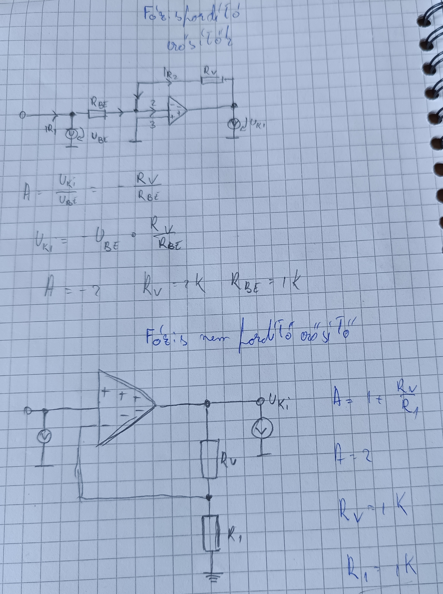
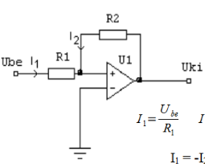
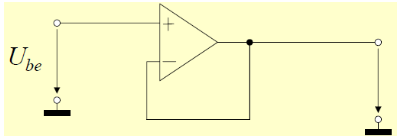
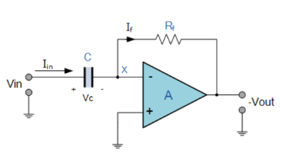
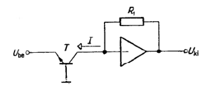

## Fázis fordító és nem fordító erősítő

### Fázis fordító képletek

Mivel a differenciális erősítő a végtelenhez tart feltételezhetjük azt, hogy:
1. a két bemenet azonos potenciálon van,
2. a bemenő árama = 0

Felírjuk a csomópont törvényt.
$\frac{U_{Be}}{R_{1}} + \frac{U_{Ki}}{R_{2}} = 0$
$A_{v} = \frac{U_{ki}}{U_{be}} = - \frac{R_{2}}{R_{1}}$

### Fázis nem fordító képletek

Itt is felírjuk a csomópont törvényt:

$\frac{U_{be}}{R_{1}} = \frac{U_{ki} - U_{be}}{R_{2}}$

## Schmidt Trigger

### Pozitív visszacsatolás/Fordító ST

### Képletek

U$_{ki}$ = + U$_{táp}$ , ha U+ > U- (U$_d$ > 0)
U$_{ki}$ = - U$_{táp}$ , ha U+ < U- (U$_d$ < 0)

U$_M$ = +U$_{táp}$ $\frac{R_{1}}{R_{1} +R_{2}}$
U$_m$ = -U$_{táp}$ $\frac{R_{1}}{R_{1}+R_{2}}$

### Negatív visszacsatolás

U$_{ki}$ = + U$_{táp}$ , ha U+ > U- (U$_d$ > 0)
U$_{ki}$ = - U$_{táp}$ , ha U+ < U- (U$_d$ < 0)

U$_M$ = +U$_{táp}$ $\frac{R_{1}}{R_{2}}$
U$_m$ = -U$_{táp}$ $\frac{R_{1}}{R_{2}}$

I$_1$ = $\frac{U_{be}}{R_{1}}$ 
I$_2$ = $\frac{U_{ki}}{R_{2}}$
I$_1$ = - I$_2$

$\frac{U_{be}}{R_{1}}$ = $\frac{-U_{ki}}{R_{2}}$
U$_{be}$ = $\frac{-R_{1}}{R_{2}}U_{ki}$

### Feszültség követő

A$_v$ = $\frac{U_{be}}{U_{ki}}$ = 1

### Összeadó erősítő

U$_{ki}$ = -($\frac{R}{R_{1}}U_{1} + \frac{R}{R_{2}}U_{2} + \dots \frac{R}{R_{N}}U_{N}$)
### Kivonó erősítő

Szuperpozíció elve alapján:
Ha U$_2$ = 0, akkor fázisfordító, 

U$_{ki}$ = - $\frac{R_{2}}{R_{2}}U_{1} = - \alpha U_{1}$

ha U$_1$ = 0 akkor fázis nem fordító

U$_p$ = $\frac{R_{p}}{R_{p} + R_{p} / \alpha}U_{2} = \frac{\alpha}{\alpha+1}U_{2}$

$$U_{ki} = \alpha(U_{2}-U_{1})$$

### Integráló áramkör

Ezt valósítják meg:
U$_{ki}$(t) = K$\int$ U$_{be}$ (t) dt + U$_{ki}$ (t = 0)

Áram törvényéből kiindulva: $\frac{U_{be}}{U_{ki}}+C\frac{dU_{ki}}{dt} = 0$

Megoldva: $U_{ki} = - \frac{1}{RC}\int U_{be}(t) \, dt+ U_{ki}(0)$

### Deriváló áramkör

Q = C * V$_{in}$
$\frac{dQ}{dt} = C\frac{DV_{in}}{dt}$
$I_{in} = C \frac{dV_{in}}{dt} = I_{F}$
Erősítő = $\frac{V_{out}}{R_{F}}=C \frac{dV_{in}}{dt}$

V$_{out}$ = -R$_F$ C$\frac{dV_{in}}{dt}$
### Logaritmáló áramkör

1. ábra
		I = I$_0$(e$^{\frac{U_{ak}}{U_{T}}}$-1) = I$_0$e$^{\frac{-U_{ki}}{U_{T}}}$
		U$_{ki}$ = - U$_T$ ln $\frac{I}{I_{0}}$ = -U$_T$ ln $\frac{U_{be}}{I_{0}R_{1}}$
		U$_T$ = $\frac{kT}{q}$ = 26 mV
		U$_{ki}$ = -60 mV * lg $\frac{U_{be}}{I_{0}R_{1}}$

2. ábra
		U$_{ki}$ = -U$_T$ lg $\frac{U_{be}}{BI_{E0}R_{1}}$
### Exponenciális erősítő

U$_{ki}$ =AI$_{E0}$R$_1$e$^{-\frac{U_{be}}{U_{T}}}$
