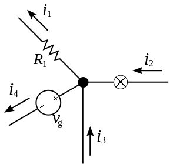
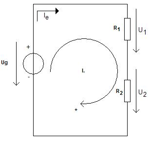
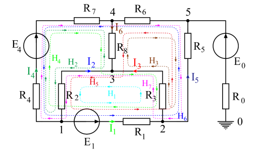

1. Törvény (Csomópont törvény)
		A csomóponti törvény párhuzamos (elágazó) áramkörökre vonatkozik. Az elágazásnál csomópont keletkezik. A törvény értelmében **a csomópontba befolyó áramok összege megegyezik az onnan elfolyó áramok összegével.** A törvény alapja az, hogy egy villamos hálózat csomópontjaiban nincs töltésfelhalmozódás (forrásmentes hely).
		
	
2. Törvény (Hurok törvény)
		Sorosan kapcsolt áramköri elemekre vonatkozik. A törvény értelmében **bármely zárt hurokban a feszültségek előjeles összege nulla.** Az előjel megállapítása úgy történik, hogy egy tetszőleges irányítású "körüljárási irányt" veszünk fel. A körüljárási irányt egy be nem záródó körvonal végén a nyíl jelzi. Ha az áramkör csak egy hurokból áll, a kör középpontjába írt "+" mutatja, hogy az ilyen irányú feszültségeket tekintjük pozitív előjelűnek (azok a feszültségek pedig, melyek iránya a körüljárási iránnyal ellentétes, negatív előjelűek). Ha az áramkör több hurokból áll, a kör középpontjába a hurok sorszáma kerül. **Zárt hurokban a feszültségforrások feszültségének előjeles összege megegyezik a feszültségesések előjeles összegével.**
	

## Kirchhoff egyenletrendszer

- Ág: az áramkör azon szakasza, ahol minden egyes áramköri elem (kétpólus) sorba van kapcsolva és az így alkotott áramköri lánc mindkét végpontja fémesen kapcsolódik az áramkörbe (zárt) (N$_{\text{Ág}}$ – ágak száma). Az ágak számának meghatározása azért is fontos, mert ugyanannyi ismeretlen, meghatározandó áram kering az áramkörben, így ennek megfelelő számú egyenletet kell felírnunk.
- Csomópont: az áramköri ágak találkozási, vagy metszéspontjai (N$_{\text{cs}}$ – csomópontok száma). Megjegyzés: ha két csomópont esetében ugyanazokkal az áramokkal kell számolnunk (amely áram az egyiknél befolyó az a másiknál kifolyó és fordítva) az ilyen csomópontokat nem tekinthetjük egymástól függetlennek, hiszen ugyanazt a csomópont-törvényt adják.
- Hurok: az áramkör zárt szakaszai, amelyeket úgy definiálunk, hogy egy adott pontból elindulunk és visszatérünk ugyanabba a pontba, de úgy, hogy egy ágat kizárólag egyszer érinthetünk (vagy ami ugyanazt jelenti, ha vannak az áramkörnek csomópontjai, akkor egy csomóponton csak egyszer haladhatunk át) (N$_{\text{Hurok}}$ – hurkok száma).
- Független hurkok száma: az áramkörben definiálható minden egyes hurokra felírhatunk egy huroktörvényt (Kirchhoff II. egyenlete), azonban a sok huroktörvény között lesznek olyanok, amelyeket lineárisan kombinálva (összeadva/kivonva) eredménykény egy másik huroktörvény kapunk. Meg kell határozzuk az adott áramkörre vonatkozóan a huroktörvények maximálisan megengedett számát, amelyeket felhasználhatunk az egyenletrendszer felírásánál úgy, hogy az egyenletrendszer megoldható legyen (N$_{\text{FHurok}}$ – független hurkok száma). A független hurkok számának meghatározására adott egy általános képlet: N$_{\text{FHurok}}$ = N$_{\text{Ág}}$ − N$_{\text{cs}}$ + 1.
- A példa áramkör esetében a következő értékek adódnak:
		N$_{\text{Ág}}$ = 6; N$_{\text{cs}}$ = 4; N$_{\text{Hurok}}$ = 7 $\rightarrow$ N$_{\text{FHurok}}$ = N$_{\text{Ág}}$ − N$_{\text{cs}}$ + 1 = 3

## Áramköri ágak

1. 1 – 2 csomópontok között: E$_1$ és R$_1$ sorosan vannak összekapcsolva és I1 áram folyik,
2. 1 – 3 csomópontok között: R$_2$ ellenálláson I$_2$ áram folyik,
3. 2 – 3 csomópontok között: R$_3$ ellenálláson I$_3$ áram folyik,
4. 1 – 2 csomópontok között: R$_4$, E$_4$ és R$_7$ sorosan vannak összekapcsolva és I4 áram folyik,
5. 2 – 4 csomópontok között: R$_5$ és R$_6$ sorosan vannak összekapcsolva és I$_5$ áram folyik (5-ös pont nem csomópont, mivel az E$_0$ és R$_0$ soros kapcsolás másik végén található 0-pont nincs az áramkörhöz kötve),
6. 4 – 3 csomópontok között: R$_8$ ellenálláson I$_6$ áram folyik.

## Huroktörvények az ábra jelöléseivel
H$_1$ hurok: E$_1$ = R$_1$I$_1$ − R$_2$I$_2$ + R$_3$I$_3$
H$_2$ hurok: E$_4$ = −R$_2$I$_2$ + (R$_4$ + R$_7$)I$_4$ + R$_8$I$_6$
H$_3$ hurok: 0 = R$_3$I$_3$ − (R$_5$ + R$_6$)I$_5$ − R$_8$I$_6$
H$_4$ hurok: E$_4$ − E$_1$ = −R$_1$I$_1$ − R$_3$I$_3$ + (R$_4$ + R$_7$)I$_4$ + R$_8$I$_6$
H$_5$ hurok: E$_1$ = R$_1$I$_1$ − R$_2$I$_2$ + (R$_5$ + R$_6$)I$_5$ + R$_8$I$_6$
H$_6$ hurok: E$_1$ − E$_4$ = R$_1$I$_1$ − (R$_4$ + R$_7$)I$_4$ + (R$_5$ + R$_6$)I$_5$
H$_7$ hurok: E$_4$ = −R$_2$I$_2$ + R$_3$I$_3$ + (R$_4$ + R$_7$)I$_4$ − (R$_5$ + R$_6$)I$_5$

## Csomópont-törvények az ábra jelöléseivel
1. csomópont: I$_1$ + I$_2$ + I$_4$ = 0
2. csomópont: I$_1$ − I$_3$ − I$_5$ = 0
3. csomópont: I$_2$ + I$_3$ + I$_6$ = 0
4. csomópont: I$_4$ + I$_5$ − I$_6$ = 0