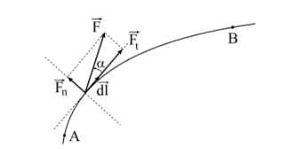
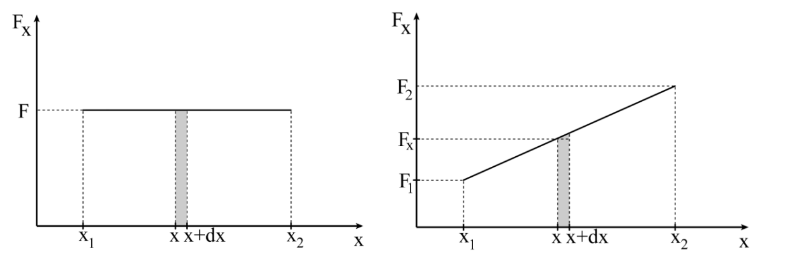
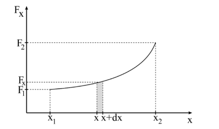

## Mechanikai munka

Egy $\vec{F}$ erő elemi $d\vec{l}$ elmozdulás során által végzett mechanikai munkát az erő és az elemi elmozdulás vektor skaláris szorzataként definiáljuk és az (1.) képlettel, míg egy véges elmozdulás esetében az elemi munka integráljaként adható meg (2.).

$$ dL = \vec{F}d\vec{l} \qquad \text{ 1. }\\
L = \int_A^B \vec{F}d\vec{l} \qquad \text{ 2.}
$$

A két vektor skaláris szorzatának értelmében az (1.) összefüggést dL = F dl cos $\alpha$ alakban írhatjuk fel, ahol az F cos $\alpha$ = F$_t$ nem más, mint az erő pálya menti (tangenciális) komponense (1. ábra). Ez az erőkomponens végzi az anyagi pont gyorsítását és ez felelős a mechanikai munkavégzésért. Ebből következik az a megállapítás, hogy ha az anyagi pontra ható erőnek nincs a pálya irányába eső komponense (vetülete) akkor az az erő nem végez elmozdítást és ennek megfelelően mechanikai munkát sem. Az erő pályára merőleges (normális) komponense, F sin $\alpha$ = F$_n$, nem vesz részt a gyorsításban, nem végez mechanikai munkát, azonban fontos szerepe van, mivel befolyásolja a súrlódási erő mértékét vagy a feszítő erő értékét.

A mechanikai munka kifejezésének adhatunk más matematikai alakot is, ha figyelembe vesszük azt, hogy egy három-dimenziós koordináta rendszerben az erőt az $\vec{F} = Fx\vec{i} + Fy\vec{j} + Fz\vec{k}$ alakban, míg az elmozdulás vektort a $dL =dx\vec{i} + dy\vec{j} + dz\vec{k}$ alakban írhatjuk fel. Ennek megfelelően az elemi munkavégzés (1.) összefüggését a (3.) alakra
$$
dL = (F_{x}\vec{i}+F_{y}\vec{j}+F_{z}\vec{k})(dx\vec{i}+dy\vec{j}+dz\vec{k})=F_{x}dx+F_{y}dy+F_{z}dz \qquad 3.
$$
míg a véges elmozdulás esetén végzett mechanikai munkát a (4.) alakra hozhatjuk. 
$$
L=\int_{A}^B \, (F_{x}dx+F_{y}dy+F_{z}dz) \qquad 4. 
$$
A (4.) egyenlet alapján megadhatjuk a mechanikai munka grafikus értelmezését. Ismerve az erő (x, y, z) koordináták szerinti függését (grafikonját) az integrálás grafikus értelmezése szerint az integrál értéke mindig a görbe alatti területtel egyezik meg (az integrál kiszámítása a szokott módon történik, az x1 és x2 tartományt felosztjuk dx szélességű részekre, kiszámítjuk az ábrákon látható téglalapok területeit, majd összegezzük ezeket). Az egyszerűség kedvéért tekintsünk egy x-irányba ható erő által létrehozott elmozdulást. A 1. ábra egy állandó értékű erő, míg a 2. ábra egy lineárisan növekvő erő esetét szemlélteti. Ezekben az esetekben egyszerű geometriai számításokkal is kiszámíthatjuk a végzett mechanikai munkát erületszámítással.
Amennyiben az erő koordináta-függése bonyolultabb, természetesen a feladatunk is bonyolódik, mert akkor az integrálást el kell végezni analitikusan (3. ábra).

A mechanikai munka származtatott fizikai mennyiség, amelynek a mértékegysége (5.) alapján az 1J (Joule).
$$
[L]_{SI}=[F]_{SI}*[l]_{SI} = 1 \frac{kg}{ms^2}*1m=1N*1m=1j\qquad 5.
$$
Az (1.) összefüggésnek van egy következménye amire oda kell figyelnünk. Mivel két vektor skaláris szorzatáról van szó, a vektorok közötti szög függvényében a mechanikai munka értéke lehet pozitív és negatív is. Egyezmény szerint a mechanikai munka pozitív abban az esetben amikor az erő végzi az anyagi ponton és negatív, ha az anyagi pont végzi az erő ellenében. Például egy testet síkfelületen gyorsít egy síkkal párhuzamos erő, amely ezáltal mechanikai munkát végez rajta. Ezt a munkát pozitívnak tekintjük. Ha a skaláris szorzatot nézzük meg ebben az esetben a ható erő és az elmozdulás vektor azonos iránnyal és irányítással rendelkezik. Ha ez a mozgás súrlódással történik, akkor a súrlódási erő szintén párhuzamos a síkfelülettel, de az irányítása az elmozdulás vektor ellentétese. Ennek megfelelően a súrlódási erő által végzett mechanikai munka negatív. Abban az esetben amikor egy anyagi pontra egyszerre több erő hat, a mechanikai munka értelmezése és a vektorok összeadása alapján, teljes mechanikai munka megegyezik az egyes erők által végzett mechanikai munkák algebrai összegével.

### A potenciál

Tekintsünk egy teret, amelynek minden pontjában értelmezve van egy erő. Az ilyen jellegű tereket erőtérnek vagy mezőnek nevezzük. Ne tévesszen meg senkit az itt használt „erő” kifejezés, mert ez nem feltétlenül egy kölcsönhatási erőt definiál. Példának okáért említhetjük az elektromos teret, amelyben az elektromos térerősséget használjuk az erőtér definiálásához (szokás elektromos térnek, de elektromos mezőnek is nevezni). Legyen az erőtér részéről ható erő az $\vec{F}\equiv \vec{F}$(x, y, z), amely az m tömegű anyagi pontra hat. Ennek megfelelően egységnyi tömegre ható erőt $\vec{f}$ definiálhatjuk az (6.) összefüggéssel.
$$
\vec{f}=\frac{\vec{F}}{m}\qquad 6.
$$
Feltételezzük azt az esetet, amikor az $\vec{f}$ erőt definiáló $f_x$, $f_y$ és $f_z$ komponenseit
kifejezhetjük egy egyértelműen meghatározott, időtől független folytonos függvény ($\varphi$(x, y, z)) parciális deriváltjainak segítségével a (7.) egyenletnek megfelelően.
$$
f_x = \frac{\partial \varphi}{\partial x} , fy = \frac{\partial\varphi}{\partial y}, fz = \frac{\partial\varphi}{\partial z}
$$
A $\varphi$(x, y, z) függvény erőfüggvénynek nevezzük és ebben az esetben $\vec{f}$ erőt a (8.) egyenlettel írhatjuk fel, amely nem mást, mint az erőfüggvény gradiense.
$$
\vec{f}=\frac{{\partial \varphi}}{\partial x}\vec{i}+\frac{{\partial \varphi}}{\partial y}\vec{j}+\frac{{\partial \varphi}}{\partial z}\vec{k}\qquad 8.
$$
$$
\vec{F}=m\left( \frac{{\partial \varphi}}{\partial x}\vec{i}+\frac{{\partial \varphi}}{\partial y}\vec{j}+\frac{{\partial\varphi}}{\partial z}\vec{k} \right)=mgrad\varphi
$$
