## Dióda
$U_{AK} = U_A - U_K$
Ha az anód és katód feszültség közti különbség $\ge$ 0.7 V, akkor a dióda nyit.
Ha a kérdés az, hogy "Mekkor a diódán eső feszültség? ($U_D$)" és tudjuk, hogy a dióda nyit, akkor a válasz $\approx$ 0.7 V. 

### 1. feladat
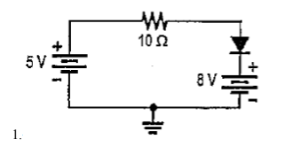
$U_{AK}$ = 5 - 8 = - 3 V
Tehát a dióda nem nyit. A mérhető feszültség 0 V.
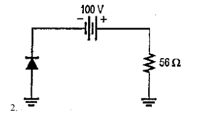
$U_{AK}$ = 0 - (-100) = 100 V
Tehát a dióda nyit. A mérhető feszültség 0.7 V.
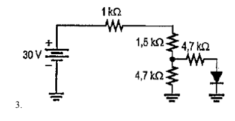
$R_1$ = 1 k$\ohm$
$R_2$ = 1,5 k$\ohm$
$R_3$ = $R_4$ = 4,7 k$\ohm$

$R_E$ = $R_1 + R_2 + \frac{R_{3}\times R_4}{R_3 + R_4}$ = 2,5 + $\frac{22,09}{9,4}$ = 2,5 + 2,35 = 4,85 k$\ohm$

I = $\frac{U}{R_E}$ = $\frac{30 (V)}{4,85 (k\ohm)}$ = 6,18556701031 mA = 6,19 mA
$U_{R_1}$ = 6,19 V
$U_{R_2}$ = 1,5 * 6,19 = 9,285 V = 9,29 V

A csomópontban lévő potenciál: 30 - 6,19 - 9,29 = 14,52 V
$I$ = $I_1$ + $I_2$
$U_{R_3}$ = 14,52 V
$I_{1}$ = $\frac{14,52}{4,7}$= 3,09 mA 
$I_2$ = $I$ - $I_1$ = 6,19 - 3,09 = 3,1 mA (csak akkor lenne helyes ha nem lenne ott a dióda)
$I_2$ = $\frac{U_{cs} - 0.7}{4,7k}$= 2,94 mA
$U_{R_4}$ = 4,7 * 2,94 = 13,82 V
$U_A$ = 0,7 V
Ötletem sincs, hogy ez így helyes-e.
Ha minden igaz: elég nagy csomóponti feszültségnél a dióda vezet tehát beírható a 0,7 V vagy 0,5 V.
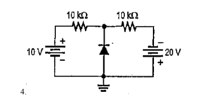
$E_1$ = 10 V, $E_2$ = 20 V
$R_1$ = $R_2$ = 10 k$\ohm$

$E_1$ - $U_{R_1}$ - $U_{R_2}$ - (-$E_2$) = 0
$E_1$ - $U_{R_1}$ - $U_{R_2}$ + $E_2$ = 0
$E_1$ - I\*$R_1$ - I\*$R_2$ + $E_2$ = 0
10V - I\*$R_1$ - I\*$R_2$ + 20V = 0
30V - I\*($R_1$ + $R_2$)= 0
30V - I\*20K = 0
I = 1,5 mA

$U_{R_1}$ = $U_{R_2}$ = 15 V
$U_K$ = 10 - 15 V, vagy 15 - 20 => $U_K$ = -5 V
$U_A$ = 0 V
$U_{AK}$ = 5 V

## Fázis fordító/nem fordító erősítő
### Fázis fordító erősítő
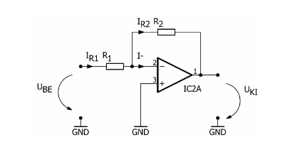
A fázis fordító és nem fordító bemenet közötti feszültség értéke 0.
$U_d = U_+ - U_- = 0 V$
$I_{R1} = I_{R2}$
$\frac{U_{be}}{R_1} = \frac{-U_{ki}}{R_2}$
$U_{ki} = -\frac{R_2}{R_1}*U_{be}$
$U_{ki} = A*U_{be}$
$A=-\frac{R_2}{R_1}$ 
A - erősítés
Ha $R_1 = R_2$ akkor $A = -1$
Ha a pozitív bemeneten van feszültség és van egy adott tápfeszültség, akkor egy picivel másabb a feladat. Az $U_{be}$ a pozitív bemeneten lévő érték és a tápfeszültség a korlát ami között mozoghat.
### Fázis nem fordító erősítő
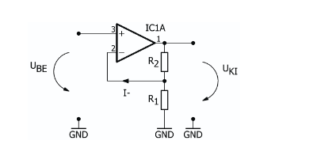
$U_+ = U_- = U_{be}U_{be} = \frac{U_{ki}}{R_1+R_2}$
$U_{ki} = U_{be} *(1 + \frac{R_2}{R_1})$
$A=1+\frac{R_2}{R_1}$
Ha $R_1$ végtelenül nagy, vagy hiányzik akkor $A=1$
## Fordító/nem fordító Schmitt-trigger
### Fordító Schmitt-trigger
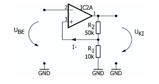
Billenési feltétel: $U_d$
Ha $U_d = 0$, akkor $U_+ = U_- = U_{be}$
$U_{be} = U_{R_1} = \frac{U_{ki}}{R_1 + R_2} * R_1$
$U_M = +U_{táp} * \frac{R_1}{R_1+R_2}$
$U_m = -U_{táp} * \frac{R_1}{R_1+R_2}$
$U_h = U_M - U_m$ (ez a hiszterézis feszültség)
### Nem fordító Schmitt-trigger
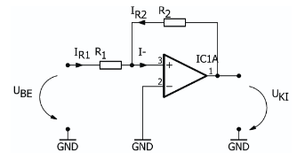
Ha $U_d = 0$, akkor $U_+ = U_- = 0V$
$I_1 = \frac{U_{be}}{R1}$ és $I_2 = \frac{U_{ki}}{R_2}$
$I_1 = - I_2$
$\frac{U_{be}}{R_1} = - \frac{U_{ki}}{R_2}$
$U_{be} = - \frac{R_1}{R_2}* U_{ki}$
$U_M = + U_{táp} * \frac{R_1}{R_2}$
$U_m = -U_{táp} * \frac{R_1}{R_2}$
## Statikus munkapont
### NPN
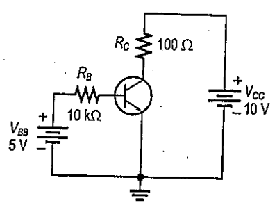
M($U_{CE}, I_{C}$)
$\beta = 150$
$I_B = \frac{U_{BB} - U_{BE}}{R_B} = 0,43\,mA$
$I_C = \beta * I_B = 64,5\,mA$
$U_{CE} = U_{CC} - U_{R_C} = 3,55\,V$
$I_E = I_C + I_B = 64,94\,mA$
$U_{CB} = U_{CE} - U_{BE} = 2,85\,V$

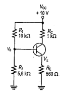
Ha $R_E$ >> 100 $\ohm$, akkor $\beta$ hanyagolható. Akkor is hanyagolható ha $\frac{R_1 *R_2}{R_1+R_2} \le \frac{R_{in}}{10}$, ahol $R_{in} = \beta * R_E$.

Itt $\beta = 100$

$U_{BB} = \frac{R_2}{R_1+R_2} * U_{CC} = 3,59\,V$
$U_{BB} = U_B$, jelölés kérdése

$U_E = U_{BB} - U_{BE} = 2,89\,V$
$I_E = \frac{U_E}{R_E} = I_C + I_B$ = 5,16 mA
Ha $I_B$ << $I_C$ (általában egy 10x-es különbség), akkor $I_E \approx I_C$ 
$I_C = 5,16\,mA$
$U_{CE} = U_{CC} - U_{RC} - U_{RE} = U_{CC} - I_C*R_C - I_C*R_E = U_{CC} - I_C(R_C+R_E) = 1,95\,V$
### PNP
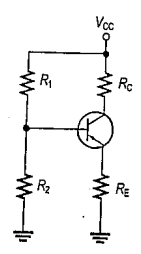
$R_1$ = 68K
$R_2$ = 47K
$R_C$ = 1,8K
$R_E$ = 2,2K
$\beta$ = 75
$V_{CC}$ = - 6 V

$R_{in} = \beta * R_E$ = 165 K$\ohm$
$\frac{R_1*R_2}{R_1+R_2} = 27,79$
$27,79 \gt \frac{165}{10}$ tehát a $\beta$ nem elhanyagolható
$U_{BB} = \frac{R_2}{R_1+R_2} * U_{BE}  = -2,45\,V$
$U_E = U_{BB} + U_{BE} = -1,75\,V$
$I_E = \frac{U_E - U_{CC}}{R_E} = 1,93\,mA$
$I_C = I_E * \frac{\beta}{\beta +1} = 1,90 mA$
$U_C = U_{CC} + I_C * R_C = -2,58\,V$
$U_{CE} = U_C - U_E = 0,83 V$
$I_B = \frac{U_{BB} - U_{BE}}{R_B} = -0,11 mA$
$R_B  =\frac{R_1*R_2}{R_1+R_2} = 27,79\,K\ohm$
## Kapcsolós feladat
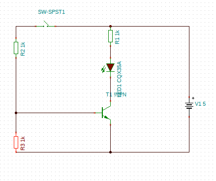
Ábrázolni kell az állapotokat idő függvényében.
Bázis Emmiter a kapcsoló felkapcsolásakor felugrik 0,7 V-ra, a Collector Emmiter 5 V-ról 0-ra, az $I_{LED}$ pedig csak szimplán felkapcsol.