## Maxwell egyenletek
| **#**    | **Megnevezés**                   | **Integrális alak**                                                                                           | **Differenciális alak**                                                                          | **Fizikai jelentés**                                            |
| -------- | -------------------------------- | ------------------------------------------------------------------------------------------------------------- | ------------------------------------------------------------------------------------------------ | --------------------------------------------------------------- |
| **I.**   | **Elektromos Gauss-törvény**     | $\oint_S \vec{E} \cdot \mathrm{d}\vec{A} = \frac{Q_{\text{belül}}}{\varepsilon_0}$                            | $\nabla \cdot \vec{E} = \frac{\rho}{\varepsilon_0}$                                              | Az elektromos tér **forrásai a töltések**.                      |
| **II.**  | **Mágneses Gauss-törvény**       | $\oint_S \vec{B} \cdot \mathrm{d}\vec{A} = 0$                                                                 | $\nabla \cdot \vec{B} = 0$                                                                       | **Nincsenek mágneses monopólusok**.                             |
| **III.** | **Faraday-féle indukciótörvény** | $\oint_C \vec{E} \cdot \mathrm{d}\vec{r} = -\frac{\mathrm{d}\Phi_B}{\mathrm{d}t}$                             | $\nabla \times \vec{E} = -\frac{\partial \vec{B}}{\partial t}$                                   | Időben változó $\vec{B}$ tér **örvényes $\vec{E}$ teret kelt**. |
| **IV.**  | **Ampère–Maxwell-törvény**       | $\oint_C \vec{B} \cdot \mathrm{d}\vec{r} = \mu_0 I + \mu_0\varepsilon_0 \frac{\mathrm{d}\Phi_E}{\mathrm{d}t}$ | $\nabla \times \vec{B} = \mu_0 \vec{J} + \mu_0\varepsilon_0 \frac{\partial \vec{E}}{\partial t}$ | Áram vagy változó $\vec{E}$ tér **mágneses teret kelt**.        |

1. Számítsa ki egy olyan külső erő által végzett mechanikai munkát, amely az elektrosztatikus erő ellenében egy Q(+) pontszerű töltés terében a végtelenből állandó sebességgel egy r helyzetű pontba viszi a q(+) próbatöltést. Definiálja ezáltal a pontszerű töltés elektromos potenciálját.
   
   $$\vec{F}_k = -\vec{F}_{e}$$ - $\vec{F}_k$ külső erő, $\vec{F}_{\text{e}}$ elektrosztatikus/Coulomb erő	$$F_{e} = \frac{1}{4\pi\varepsilon_0} \frac{Q q}{r^2}$$ $$L = \int_{\infty}^{r} \vec{F}_k \cdot d\vec{r} = \int_{\infty}^{r} \left( - \frac{1}{4\pi\varepsilon_0} \frac{Q q}{r^2} \right) dr$$
   L - mechanikai munka
   
   $$L = -\frac{Q q}{4\pi\varepsilon_0} \int_{\infty}^{r} r^{-2} dr = -\frac{Q q}{4\pi\varepsilon_0} \left[ -r^{-1} \right]_{\infty}^{r} = \frac{Q q}{4\pi\varepsilon_0} \left( \frac{1}{r} - \frac{1}{\infty} \right) = \frac{1}{4\pi\varepsilon_0} \frac{Q q}{r}$$
   
	**Az elektromos potenciál definíciója:**
	A pontszerű töltés elektromos potenciálja ($V$) egy adott pontban megegyezik azzal a munkával, amelyet a külső erő végez, miközben egy egységnyi pozitív próbatöltést ($q=1\text{ C}$) a végtelenből állandó sebességgel az adott pontba visz. Képlettel:
	$$V = \frac{L}{q} = \frac{1}{4\pi\varepsilon_0} \frac{Q}{r}$$

	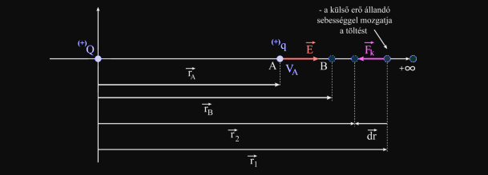
   
   
2. Egy S felületű egyenáram által átjárt vezető keret esetében adja meg a keret mágneses nyomatékának kifejezését (vektoriálisan és skalárisan). Amennyiben ez a vezető keret egy homogén mágneses térben kerül, amelynek az iránya merőleges a vezető keret forgástengelyére, adja meg a vezető keretre ható forgató nyomatékot (vektoriálisan és skalárisan). Adja meg a maximális forgató nyomaték megjelenésének feltételét, majd ebből kiindulva adja meg a mágneses tér indukció mértékegységének definícióját.
   
   - **A keret mágneses nyomatéka ($\vec{m}$):**
    
    - **Skalárisan:** A mágneses nyomaték nagysága a keretben folyó $I$ áram és a keret által bezárt $S$ felület szorzata:        $$\mu = I \cdot S$$
    - **Vektoriálisan:** A nyomaték vektorirányát a felület $\vec{n}$ normális egységvektora határozza meg, amelyet az áram irányára alkalmazott jobbkéz-szabály (dugóhúzó-szabály) jelöl ki:        $$\vec{\mu} = I \cdot \vec{S} = I \cdot S \cdot \vec{n}$$
  - **A vezető keretre ható forgatónyomaték ($\vec{\tau}$):**
    Ha a keret olyan homogén mágneses térbe ($\vec{B}$) kerül, amelynek iránya merőleges a keret forgástengelyére, a tér a következő forgatónyomatékot fejti ki rá:
    - **Vektoriálisan:**$$\vec{\tau} = \vec{\mu} \times \vec{B}$$
    - **Skalárisan:**$$\tau = \mu \cdot B \cdot \sin\alpha = I \cdot S \cdot B \cdot \sin\alpha$$
        Ahol $\alpha$ a mágneses nyomatékvektor ($\vec{\mu}$ vagy a felület normálisa, $\vec{n}$) és a mágneses indukcióvektor ($\vec{B}$) által bezárt szög.

	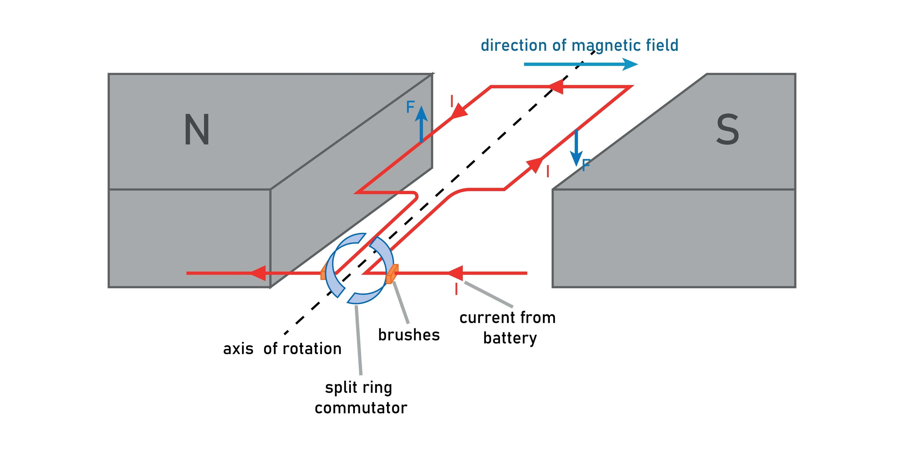

  - **A maximális forgatónyomaték megjelenésének feltétele:**
    A fenti skaláris egyenletben a nyomaték akkor éri el a maximumát ($\tau_{\max}$), amikor a $\sin\alpha$ függvény értéke a lehető legnagyobb, vagyis $\sin\alpha = 1$.
    - **Matematikai feltétel:** $\alpha = 90^\circ$ (vagy $\frac{\pi}{2}$ radián).
    - **Fizikai/Geometriai jelentés:** A keret normálisának ($\vec{n}$) merőlegesnek kell lennie a mágneses tér indukcióvonalaira ($\vec{B}$). Ez azt jelenti, hogy magának a **vezető keret síkjának párhuzamosnak kell lennie a mágneses tér vonalaival**.
    - A maximális forgatónyomaték értéke ekkor:$$\tau_{\max} = I \cdot S \cdot B$$
  - **A mágneses tér indukció mértékegységének (Tesla) definíciója:**
    A maximális forgatónyomaték képletéből kifejezve a mágneses indukciót:    $$B = \frac{\tau_{\max}}{I \cdot S}$$
    Az SI-mértékegységeket behelyettesítve:$$1 \text{ Tesla (T)} = \frac{1 \text{ N}\cdot\text{m}}{1 \text{ A} \cdot 1 \text{ m}^2} = 1 \frac{\text{N}}{\text{A}\cdot\text{m}}$$
    **Szöveges definíció:** $1\text{ Tesla}$ a mágneses indukciója annak a homogén mágneses térnek, amely egy $1\text{ m}^2$ felületű, benne $1\text{ Amper}$ erősségű egyenáramot szállító vezető keretre (amikor annak síkja párhuzamos a tér irányával) maximálisan $1\text{ Newton-méter}$ forgatónyomatékot gyakorol.
   
  
3. Ampére-törvény (eltolási áramsűrűség nélküli alak!). Differenciális- és integrális alak. Stokes-integrálegyenlet felírása. Ábra. A körüljárási irány és a felület irányítottsága közötti összefüggés. Az Ampére-törvény alkalmazása egy végtelen hosszú egy végtelenül hosszú, elhanyagolható vastagságú vezetőben folyó egyenáram által létrehozott tér indukciójának kiszámítására.
   
    **Integrális alak:** Egy tetszőleges $L$ zárt görbére vonatkozó mágneses indukció cirkulációja megegyezik a görbe által határolt felületen átfolyó áramok algebrai összegének és a vákuum permeabilitásának ($\mu_0$) szorzatával.$$\oint_L \vec{B} \cdot d\vec{l} = \mu_0 \int_S \vec{J} \cdot d\vec{S} = \mu_0 \sum I_i$$    
	**Differenciális alak:**$$\nabla \times \vec{B} = \mu_0 \vec{J}$$
	**Stokes-integrálegyenlet:**$$\oint_L \vec{B} \cdot d\vec{l} = \int_S (\nabla \times \vec{B}) \cdot d\vec{S}$$
	**Alkalmazás egy végtelen hosszú egyenes vezetőre:**
	Vegyünk fel egy $r$ sugarú koncentrikus kört (Ampère-görbe) a vezető körül. A mágneses tér szimmetria miatt a kör mentén érintő irányú és állandó nagyságú.
	$$\oint_L \vec{B} \cdot d\vec{l} = B \oint_L dl = B (2\pi r)$$
	Az Ampère-törvény alapján ez egyenlő $\mu_0 I$-vel:$$B (2\pi r) = \mu_0 I \implies B = \frac{\mu_0 I}{2\pi r}$$
	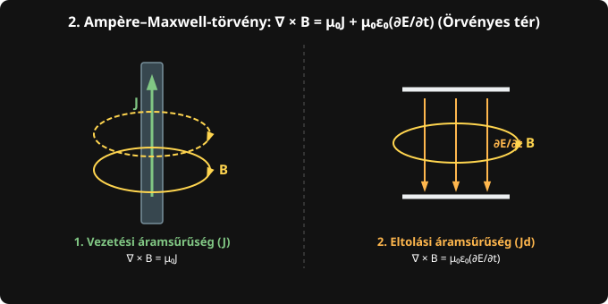

4. Magyarázza meg, mi a jelentése a $E = -grad\,V$ összefüggésnek. Tudva azt, hogy egy pontszerű töltés elektrosztatikus potenciáljának kifejezése vákuumban a $V = \frac{Q}{4\pi \epsilon_0}\frac{1}{r}$, vezesse le a térerősséget megadó összefüggést!
   
	**Fizikai jelentése:** Az elektromos térerősség a potenciál térbeli negatív gradiense. Ez azt jelenti, hogy a térerősség vektor abba az irányba mutat, amerre az elektromos potenciál a leggyorsabban csökken, nagysága pedig megadja ennek a potenciál-csökkenésnek a térbeli meredekségét.

	**Térerősség levezetése pontszerű töltés esetén:**
	$$\vec{E} = -\text{grad}\,V = -\left(\frac{\partial V}{\partial x}\vec{i} + \frac{\partial V}{\partial y}\vec{j} + \frac{\partial V}{\partial z}\vec{k}\right)$$
	Tudva, hogy $r = \sqrt{x^2 + y^2 + z^2}$, a potenciál: $V = \frac{Q}{4\pi\varepsilon_0}\frac{1}{\sqrt{x^2+y^2+z^2}}$
	$$\frac{\partial V}{\partial x} = -\frac{1}{2}\frac{Q}{4\pi\varepsilon_0}\frac{2x}{(x^2+y^2+z^2)^{3/2}}$$
	$$\vec{E} = \frac{Q}{4\pi\varepsilon_0} \frac{x\vec{i} + y\vec{j} + z\vec{k}}{(x^2+y^2+z^2)^{3/2}} = \frac{Q}{4\pi\varepsilon_0 r^2} \frac{\vec{r}}{r}$$

5. A görbületi-sugár és a töltéssűrűség közötti összefüggés levezetése és értelmezése. Szemléltessen ábrán!
   
	Tekintsünk két, egymástól távol lévő fémgömböt ($R_1$ és $R_2$ sugarakkal), amelyeket egy vékony, vezető huzal köt össze. Mivel össze vannak kötve, a rendszer ekvipotenciális felületet alkot: $V_1 = V_2$.$$\frac{1}{4\pi\varepsilon_0} \frac{Q_1}{R_1} = \frac{1}{4\pi\varepsilon_0} \frac{Q_2}{R_2} \implies \frac{Q_1}{R_1} = \frac{Q_2}{R_2}$$
	A felületi töltéssűrűség $\sigma = \frac{Q}{4\pi R^2}$, amiből $Q = \sigma 4\pi R^2$. Ezt behelyettesítve:$$\frac{\sigma_1 4\pi R_1^2}{R_1} = \frac{\sigma_2 4\pi R_2^2}{R_2} \implies \sigma_1 R_1 = \sigma_2 R_2$$$$\frac{\sigma_1}{\sigma_2} = \frac{R_2}{R_1}$$
	**Értelmezés:** A felületi töltéssűrűség fordítottan arányos a felület görbületi sugarával. Minél "hegyesebb" egy felület (kisebb $R$), annál sűrűbben halmozódnak fel ott a töltések (ez a csúcshatás elve).

	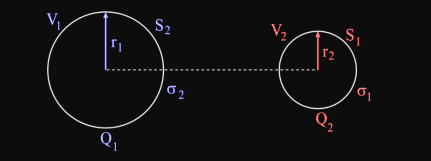
	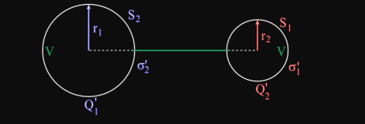

6. Tekintsen egy tömör fémet, amely pozitív felületi töltéssűrűséggel van ellátva. Elektrosztatikus esetben, mekkora lehet az elektromos tér erővonalához húzott érintő és a felületi merőleges közötti szög, ha ezt a fém felületének egyik pontjának a szemszögéből tárgyaljuk? Szemléltesse ábrán és támassza alá a válaszát összefüggésekkel és magyarázattal!
   
   Az erővonalhoz húzott érintő maga a térerősség vektora. Mivel a térerősség szigorúan merőleges a fém felületére, a fém felületi normálisával (amely szintén merőleges a felületre) pontosan párhuzamos lesz. Így a kettő által bezárt szög **0 fok** (vagy radiánban 0).

	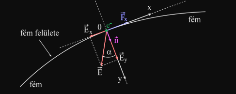
   
7. Adja meg a mágneses Gauss-törvény és Faraday-törvény differenciális alakját és adja meg mindegyik egyenlet fizikai jelentését (készítsen ábrákat a fizikai értelmezések szemléltetéséhez!).
   
   - **Mágneses Gauss-törvény:**    $$\nabla \cdot \vec{B} = 0$$_Fizikai jelentés:_ Nincsenek mágneses monopólusok (mágneses töltések). A mágneses erővonalak önmagukba záródó görbék, nincs kezdetük és végük.
	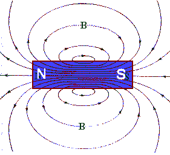
  - **Faraday-féle indukciós törvény:**$$\nabla \times \vec{E} = -\frac{\partial \vec{B}}{\partial t}$$_Fizikai jelentés:_ Egy időben változó mágneses tér maga körül egy zárt örvénylő (nem konzervatív) elektromos teret hoz létre.

	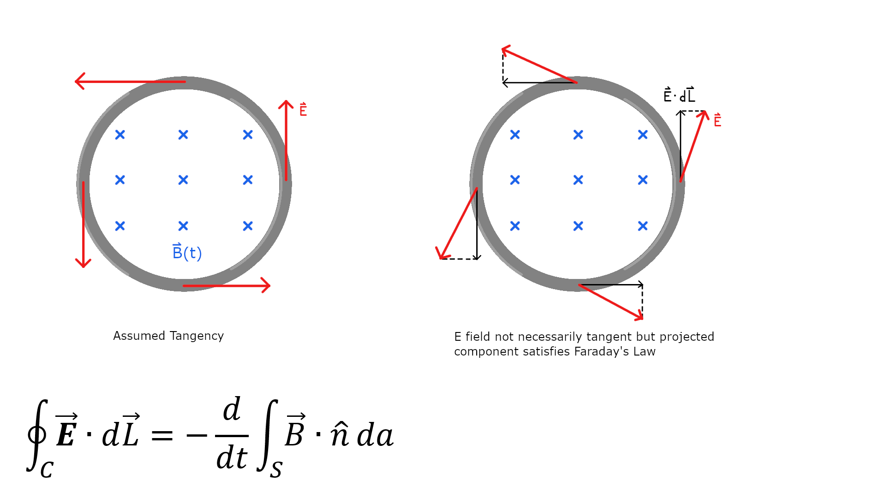

   
8. Egy $\vec{p}$ dipólus nyomatékkal rendelkező elektromos dipólus, $\vec{E}$ térerősségű elektrosztatikus térben helyezkedik el úgy, hogy a két vektor közötti szög $\alpha$. A forgató nyomaték definíciós képletéből kiindulva vezesse le a forgató nyomaték $\vec{p}$ és $\vec{E}$ vektorokkal megadott kifejezést.
   
  - **A dipólus modellje és a ható erők:**
    
    Az elektromos dipólus két egyenlő nagyságú, de ellentétes előjelű pontszerű töltésből ($+q$ és $-q$) áll, amelyeket egy apró $\vec{d}$ vektor választ el egymástól (a vektor a negatív töltéstől a pozitív felé mutat).
    
    Homogén elektromos térbe ($\vec{E}$) helyezve őket, a két töltésre a következő erők hatnak:$$\vec{F}_+ = q\vec{E}$$$$\vec{F}_- = -q\vec{E}$$
  - **A forgatónyomaték definíciója:**
    A forgatónyomaték általános vektoriális definíciója egy adott origóra vagy vonatkoztatási pontra nézve:$$\vec{\tau} = \vec{r} \times \vec{F}$$Mivel a két erő egyenlő nagyságú és ellentétes irányú ($\vec{F}_+ = -\vec{F}_-$), egy **erőpárt** alkotnak. Az erőpár eredő forgatónyomatéka független a vonatkoztatási pont megválasztásától. A levezetés egyszerűsítése érdekében válasszuk a vonatkoztatási pontot a $-q$ töltés helyének.
    
  - **Vektoriális levezetés:**
    Ekkor a $-q$ töltés helyvektora $\vec{r}_- = 0$, a $+q$ töltés helyvektora pedig pontosan $\vec{r}_+ = \vec{d}$ lesz. A teljes forgatónyomaték a két erő nyomatékának összege:$$\vec{\tau} = (\vec{r}_- \times \vec{F}_-) + (\vec{r}_+ \times \vec{F}_+)$$$$\vec{\tau} = (0 \times \vec{F}_-) + (\vec{d} \times q\vec{E})$$$$\vec{\tau} = \vec{d} \times (q\vec{E})$$
    Mivel a $q$ töltés egy skalár mennyiség, a szorzótényezők sorrendje felcserélhető és kiemelhető:$$\vec{\tau} = (q\vec{d}) \times \vec{E}$$
  - **A dipólusnyomaték bevezetése és a végeredmény:**
    Az elektromos dipólusnyomaték definíció szerint: $\vec{p} = q\vec{d}$. Ezt behelyettesítve megkapjuk a **vektoriális kifejezést**:$$\vec{\tau} = \vec{p} \times \vec{E}$$
    A vektoriális szorzat definíciójából adódóan a forgatónyomaték nagyságának **skaláris kifejezése**:$$\tau = p \cdot E \cdot \sin\alpha$$
    Ahol $\alpha$ a dipólusnyomaték ($\vec{p}$) és az elektromos térerősség ($\vec{E}$) vektorok által bezárt szög.
    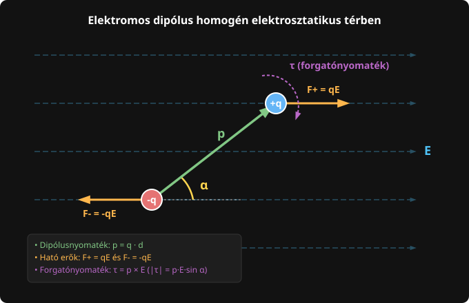
   
9. Elektromos Gauss-tétel. Differenciális- és integrális alak. Gauss-Osztogradszkij integrálegyenlet felírása. Ábra. Gauss-felület jelentése. A Gauss-tétel alkalmazása egy pozitív homogén eloszlású Q töltéssel rendelkező R sugarú gömb által létrehozott elektrosztatikus tér térerősségének kiszámítására a gömbön kívül elhelyezkedő pontokban.
   
      - **Integrális alak:** Bármely zárt felületre ($S$) vett elektromos fluxus megegyezik a felület által bezárt térfogatban lévő összes töltés és a vákuum permittivitásának ($\varepsilon_0$) hányadosával.    $$\oint_S \vec{E} \cdot d\vec{S} = \frac{\sum Q_{\text{b}}}{\varepsilon_0}$$
	  - **Differenciális alak:**$$\nabla \cdot \vec{E} = \frac{\rho}{\varepsilon_0}$$_(ahol $\rho$ a térfogati töltéssűrűség)._
  
    - **Gauss-Osztogradszkij integrálegyenlet:** $$\oint_S \vec{E} \cdot d\vec{S} = \int_V (\nabla \cdot \vec{E}) dV$$
   - **Gauss-felület jelentése:** Egy fiktív, matematikailag megválasztott, zárt burkolófelület (pl. gömb vagy henger), amelyet azért veszünk fel, hogy a tér szimmetriáit kihasználva a fluxus integrált egyszerű geometriai szorzattá alakíthassuk.
	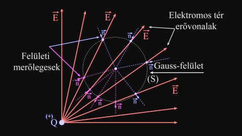
  
	**Alkalmazás homogén eloszlású $Q$ töltésű, $R$ sugarú gömbre (gömbön kívül, $r > R$):**
	A szimmetria miatt vegyünk fel egy $r$ sugarú koncentrikus Gauss-gömböt. A térerősség ezen a felületen mindenhol merőleges és állandó nagyságú.$$\oint_S \vec{E} \cdot d\vec{S} = E \oint_S dS = E (4\pi r^2)$$
	A Gauss-törvény alapján:$$E (4\pi r^2) = \frac{Q}{\varepsilon_0} \implies E = \frac{1}{4\pi\varepsilon_0} \frac{Q}{r^2}$$
	Ábrázolás:
	- Rajzolj egy gömböt (folytonos vonalas kör), benne egy $Q^+$ töltéssel és egy R sugárral.
	- Rajzolj egy Gauss felületet (szaggatott vonalas kör), amiben megtalálható az előző gömb. Továbbá rajzold fel az r sugarat ami a Gauss-felületen egy P pontba mutat. A P pontból húzz egy $\vec{n}$-t, és azon túl egy $\vec{E}$-t

10. Tekintsen egy végtelenül hosszú és elhanyagolható vastagságú vezetéket, amelyben I erősségű áram folyik. Ha a vezeték egy B indukciójú homogén mágneses térben van úgy, hogy a mágneses indukció merőleges a vezetékre, akkor kiindulva az elektronokra ható Lorentz-erő kifejezéséből, vezesse le az erő kifejezését a mágneses tér indukció, a vezeték egységnyi hosszúsága és a vezetékben folyó áram függvényében.
   
	   A mágneses térben mozgó egyetlen elektronra ható Lorentz-erő:$$\vec{F}_L = -e(\vec{v} \times \vec{B}) = q(\vec{v}\times\vec{B})$$
	Tekintsünk a vezetékből egy $l$ hosszúságú darabot.
	$$\vec{F} = Q*\vec{v} \times \vec{B}$$
	Mivel a mágneses indukció merőleges a vezetékre ($\vec{v} \perp \vec{B}$), a vektoriális szorzat nagysága a szinusz ($90\text{ fok} = 1$) miatt: $F = Q*v*B$.
	$$v = \frac{l}{\Delta t} => \Delta t = \frac{l}{v}$$
	$$Q = I * \Delta t = I * \frac{l}{v}$$
	Tehát:
	$$F = (I * \frac{l}{v})*v*B$$
	Szóval az egy egység hosszúságra ható erő:
	$$f = \frac{F}{l} = I * B$$

	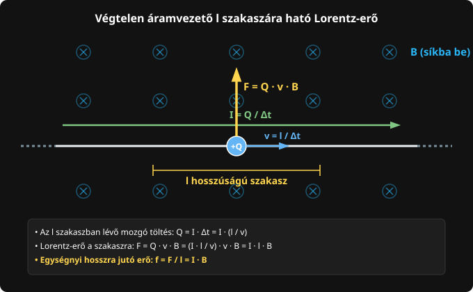

11. Mutasssa be milyen erőhatást gyakorol egymásra két végtelen hosszúságú végtelenül vékonynak tekintett egyenes vezető, amelyekben azonos irányú áramok folynak! Készítsen ábrát és tüntessen fel minden szükséges mennyiséget!
   
	Két végtelen hosszú, $d$ távolságra lévő párhuzamos vezeték, azonos irányú $I_1$ és $I_2$ áramokkal.

	Az első vezeték az Ampère-törvény értelmében mágneses teret hoz létre a második vezeték helyén, amelynek nagysága:$$B_1 = \frac{\mu_0 I_1}{2\pi d}$$
	A jobbkéz-szabály alapján $B_1$ a második vezetékre merőlegesen mutat a síkba befelé.
	Az erre a $B_1$ térbe helyezett második vezeték $L$ hosszúságú szakaszára ható Laplace-erő:
	$$F_2 = I_2 L B_1 = I_2 L \left( \frac{\mu_0 I_1}{2\pi d} \right) = \frac{\mu_0 I_1 I_2 L}{2\pi d}$$
	**Erő iránya:** A vektoriális szorzat ($\vec{l} \times \vec{B}$) bal kéz/jobb kéz szabályát alkalmazva látjuk, hogy a létrejövő erő a másik vezeték felé mutat. **Azonos áramirány esetén a két vezeték vonzza egymást.**

	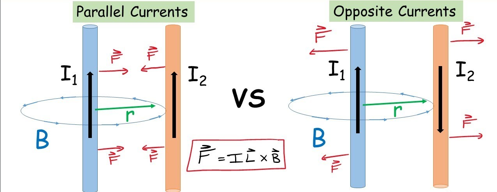

12. Egy elektron sebességvektor a következő poláris koordinátákkal rendelkezik: (400 km/s, 45 fok, 45 fok). Az elektron belép egy homogén mágneses térbe, amelynek a mágneses indukciója párhuzamos a koordinátarendszer Oz tengelyével ($\vec{B} = B\vec{k}$). Számítsa ki az elektronra ható erő értékét, adja meg a vektoriális kifejezését és rajzolja le egy ábrára az elektronra ha erő-, a sebesség- és a mágneses tér indukció vektorokat!
   
	   $$v_x = v \sin\theta \cos\phi = 4 \cdot 10^5 \cdot \sin(45^\circ) \cos(45^\circ) = 4 \cdot 10^5 \cdot \frac{\sqrt{2}}{2} \cdot \frac{\sqrt{2}}{2} = 2 \cdot 10^5\text{ m/s}$$

	$$v_y = v \sin\theta \sin\phi = 4 \cdot 10^5 \cdot \frac{\sqrt{2}}{2} \cdot \frac{\sqrt{2}}{2} = 2 \cdot 10^5\text{ m/s}$$

	$$v_z = v \cos\theta = 4 \cdot 10^5 \cdot \frac{\sqrt{2}}{2} \approx 2,828 \cdot 10^5\text{ m/s}$$

	Tehát a sebességvektor: $\vec{v} = (2\cdot 10^5 \vec{i} + 2\cdot 10^5 \vec{j} + 2\sqrt{2}\cdot 10^5 \vec{k})\text{ m/s}$.

	**A Lorentz-erő vektoriális kiszámítása:**
	$$\vec{F} = q(\vec{v} \times \vec{B}) = -e \begin{vmatrix} \vec{i} & \vec{j} & \vec{k} \\ v_x & v_y & v_z \\ 0 & 0 & B \end{vmatrix}$$$$\vec{F} = -e \left[ \vec{i}(v_y B - 0) - \vec{j}(v_x B - 0) + \vec{k}(0 - 0) \right]$$$$\vec{F} = -e (2\cdot 10^5 B \vec{i} - 2\cdot 10^5 B \vec{j})$$Behelyettesítve az elektron töltését:$$\vec{F} = (-3,204 \cdot 10^{-14} B)\vec{i} + (3,204 \cdot 10^{-14} B)\vec{j} \quad [\text{N}]$$

	**Az erő nagysága:**

	A vektoriális szorzatból vagy az $F = e B v \sin\theta$ képletből közvetlenül is adódik, hiszen a mágneses tér Z irányú, a sebesség és a Z tengely bezárt szöge pedig $45\text{ fok}$:

	$$F = (1,602 \cdot 10^{-19}) \cdot B \cdot (4 \cdot 10^5) \cdot \sin(45^\circ) \approx 4,53 \cdot 10^{-14} \cdot B \quad [\text{N}]$$

	_(Ahol $B$-t Teslában behelyettesítve megkapjuk a Newton értéket)._
	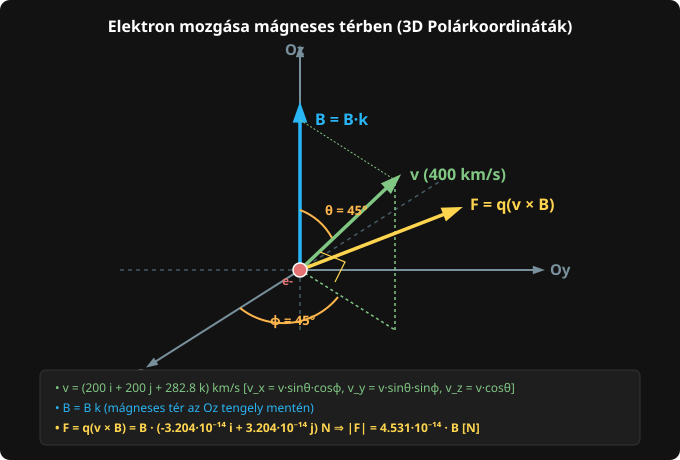
   
13. Adja meg az elektromos Gauss-törvény és az Ampére-törvény (kiegészítve az eltolási áramsűrűséggel) differenciális alakját és adja meg mindegyik egyenlet fizikai jelentését (készítsen ábrákat a fizikai értelmezések szemléltetéséhez!).
   
   - **Elektromos Gauss-törvény:**
    
    $$\nabla \cdot \vec{E} = \frac{\rho}{\varepsilon_0}$$
    
  - **Mennyiségek:**
    - $\nabla \cdot \vec{E} = \text{div}\,\vec{E}$ : az elektromos térerősség divergenciája (forrássűrűsége).
    - $\rho$ : a térfogati elektromos töltéssűrűség ($\text{C/m}^3$).    
    - $\varepsilon_0$ : a vákuum permittivitása ($\text{A}\cdot\text{s}/(\text{V}\cdot\text{m})$).
    
  - **Fizikai jelentés:**
    Az elektromos mező **forrásos tér**. Az elektromos mező forrásai az elektromos töltések ($\rho$).
    - Ahol **pozitív töltéssűrűség** van ($\rho > 0$), ott a tér divergenciája pozitív ($\nabla \cdot \vec{E} > 0$), vagyis a pont elektromos **forrásként** viselkedik (az erővonalak innen indulnak ki).
    - Ahol **negatív töltéssűrűség** van ($\rho < 0$), ott a tér divergenciája negatív ($\nabla \cdot \vec{E} < 0$), vagyis a pont elektromos **nyelőként** viselkedik (az erővonalak itt végződnek).
    - Töltésmentes térrészben ($\rho = 0$) a tér divergenciamentes ($\nabla \cdot \vec{E} = 0$).
      
    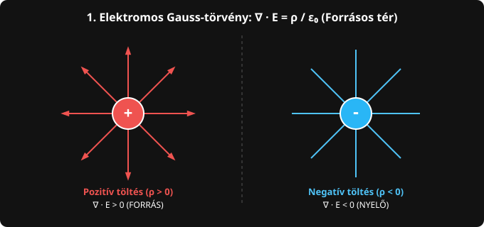
    
  - **Kibővített Ampère-törvény (Ampère-Maxwell törvény):**    $$\nabla \times \vec{B} = \mu_0 \vec{J} + \mu_0 \varepsilon_0 \frac{\partial \vec{E}}{\partial t}$$
  - **Mennyiségek:**
    - $\nabla \times \vec{B} = \text{rot}\,\vec{B}$ : a mágneses indukció rotációja (örvényessége).
    - $\vec{J}$ : a vezetési (valódi) áramsűrűség ($\text{A/m}^2$).
    - $\vec{J}_d = \varepsilon_0 \frac{\partial \vec{E}}{\partial t} = \frac{\partial \vec{D}}{\partial t}$ : az **eltolási áramsűrűség** ($\text{A/m}^2$).
    - $\mu_0$ : a vákuum permeabilitása.
  - **Fizikai jelentés:**
    A mágneses tér **örvényes tér** ($\nabla \times \vec{B} \neq 0$). Mágneses térörvényeket két független forrás gerjeszthet:
    1. **Vezetési áramok ($\vec{J}$):** A mozgó töltések (elektromos áram) zárt mágneses erővonalakat keltenek maguk körül.
    2. **Időben változó elektromos tér ($\frac{\partial \vec{E}}{\partial t}$):** Ha az elektromos tér időben változik, az eltolási áramsűrűséget ($\vec{J}_d$) hoz létre, ami ugyanolyan örvényes mágneses mezőt generál, mint a valódi töltésáramlás (például a feltöltődő kondenzátor lemezei közötti vákuumban).
       
    