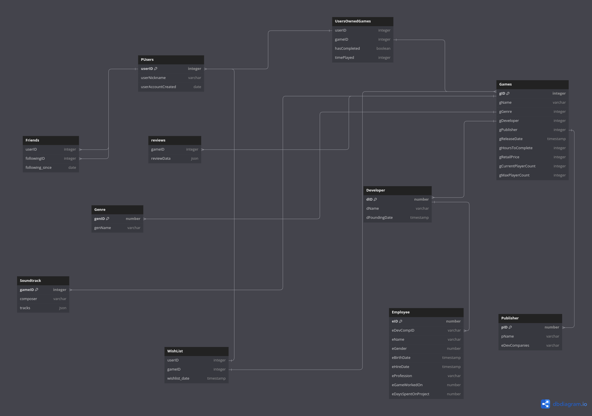

# Dokumentáció
Az adatbázisom egy online webáruházhoz lett tervezve. A felhasználó tud fiókot létrehozni, játékokat vásárolni, barátokat szerezni és technikai részleteket megnézni az általa vásárolt játékokról. 
## Users tábla
Található benne egy ID oszlop, elsődleges kulcsként. Utána egy nickname mező ami a felhasználóneveket tartalmazza és végül egy account_creation_date, hogy a felhasználó megnézhesse mikor készítette el a fiókját.
## Wishlist tábla
Itt szerepel a felhasználók kívánságlistája. Ha esetleg nincs lehetősége megvásárolni az adott játékot, berakhatja ebbe a táblába és később megvásárolja.
## Friends tábla
Szerepel benne a felhasználó ID-ja, a barát ID-ja aki szintén egy User és a dátum amikor barátokká váltak.
## UserOwnedGames tábla
Eltárolja a felhasználót, az adott játékot, hogy befejezte-e az adott játékot és, hogy mennyit játszott vele.
## Employee tábla
Eltárolja a dolgozókat és az információkat róluk. Megnézhetjük melyik cégnél dolgozik az illető, milyen pozícióban és mennyi ideje dolgoznak az adott játékon.
## Developer tábla
Tartalmazza a cég ID-ját, nevét és alapítási dátumát.
## Publisher tábla
Szintén ID-t és a kiadó nevét tartalmazza, plusz az általuk megvásárolt fejlesztő cégeket.
## Game tábla
A legrészletesebb tábla. Minden fontosabb infót tartalmaz a játékról, köztük azt is, hogy piaci áron mennyibe kerül és mennyi ideig tart végigjátszani.
## Soundtrack tábla
Tartalmazza a kompózerek által készített zenéket és, hogy melyik játékhoz lettek készítve.
## Reviews tábla
A felhasználók által hagyott értékelések az adott játéknál. 
## Genre tábla
Egy egyszerű tábla ami a különböző zsánereket tartalmazza

PUsers(<u>userID</u>, uNickname, account_creation_date)
WishList(<u style="
text-decoration-style: dotted;">userID</u>, <u style="
text-decoration-style: dotted;">gameID</u>, wishlist_date)
Friends(<u style="
text-decoration-style: dotted;">userID</u>, <u style="
text-decoration-style: dotted;">friendID</u>, following_since)
UserOwnedGames(<u style="
text-decoration-style: dotted;">userID</u>, <u style="
text-decoration-style: dotted;">gameID</u>, hasCompleted, timePlayed)
Employee(<u>eID</u>, <u style="
text-decoration-style: dotted;">eDevCompID</u>, eName, eGender, eBirthDate, eHireDate, eProfession, <u style="
text-decoration-style: dotted;">eGameWorkedOn</u>, eDaysSpentOnProject)
Developer(<u>dID</u>,dName, dFoundingDate)
Publisher(<u>pID</u>, pName, pDevCompanies)
Game(<u>gID</u>, gName, <u style="
text-decoration-style: dotted;">gGenre</u>, <u style="
text-decoration-style: dotted;">gDeveloper</u>, <u style="
text-decoration-style: dotted;">gPublisher</u>, gReleaseDate, gHoursToComplete, gRetailPrice, gCurrentPlayerCount, gMaxPlayerCount)
Soundtrack(<u style="
text-decoration-style: dotted;">gameID</u>, composer, tracks)
Reviews(<u style="
text-decoration-style: dotted;">gameID</u>, reviewData)
Genre(<u>genID</u>, genName)