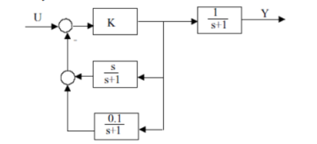
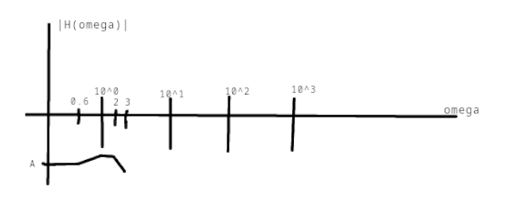

Jelek tulajdonságai. Műveletek jelekkel.
x(t) - folytonos jel
x\[t] - diszkrét idejű jel
#### Jelek osztályozása
- Időbeli jellemzők szerint: 
	- Folytonos idejű jel: x(t), minden t $\in \mathbb{R}$
	- Diszkrét idejű jelek: x\[n], csak egész időpontokban van értelmezve
- Értékkészlet szerint:
	- Folytonos értékű: bármilyen valós számot felvehet
	- Diszkrét értékű: csak meghatározott értékeket vehet fel
- Determinisztikus vs. Sztochasztikus
	- Determinisztikus jel: teljesen meghatározható matematikai leírással
	- Sztochasztikus jel: véletlenszerű, csak statisztikai jellemzőkkel írható le
- Energia és teljesítmény alapján
	- Energiajel: ha véges energiája van
		$E = \int_{-\infty}^{\infty} |x(t)^2 dt < \infty$
	- Teljesítményjel: ha a teljesítménye véges, de az energiája végtelen
		$P = \lim_{T -> \infty} \frac{1}{2T} \int_{-T}^{T} |x(t)|^2 dt < \infty$
- Periódikus és nem-periódikus
	- Periódikus: x(t) = x(t + T) minden t-re egy adott T periódusidő mellett
	- Nem periódikus: nincs ilyen T
#### Műveletek jelekkel
- Összeadás: y(t) = $x_1(t)$ + $x_2(t)$
- Skálázás: y(t) = $a*x(t)$
- Tükrözés: y(t) = $x(-t)$
- Eltolás:
	- Késleltetés: y(t) = $x(t-t_0)$
	- Előretolás: y(t) = $x(t+t_0)$

- Időbeli nyújtás/zsugoritás:
	- y(t) = $x(a*t)$, ahol
	- a > 1 : zsugorítás (gyorsabb)
	- 0 < a < 1: nyújtás (lassabb)

- Deriválás és integrálás (folytonos jelek esetén):
	- Deriválás: y(t) = $\frac{d}{dt}x(t)$
	- Integrálás: y(t) = $\int^{t}_{-\infty}x(\tau) d\tau$
- Konvolúció:
	- y(t) = $(x*h)(t) = \int^{\infty}_{-\infty} x(\tau)h(t-\tau)d\tau$
### Átviteli függvény és K konstans

$H(s)=\frac{Y(s)}{U(S)}$
$Y(s) = K*\frac{1}{s+1}$
$U_a(s) = \frac{\frac{s}{s+1}}{1+\frac{s}{s+1}*\frac{0.1}{s+1}} = \frac{\frac{s}{s+1}}{1+\frac{0.1s}{(s+1)^2}}=\frac{\frac{s}{s+1}}{1+\frac{0.1s}{(s+1)^2}}\frac{(s+1)^2}{(s+1)^2}=\frac{s(s+1)}{s^2+2.1s+1}$
$U(s) = 1 + K*U_a(s)$
a) $H(s) = \frac{K}{1+K*\frac{s(s+1)}{s^2+2.1s+1)}}\frac{1}{s+1}=\frac{K}{(s+1)+\frac{sK}{s^2+2.1s+1}}$
b)
$\frac{sK + (s+1)(s^2+2.1s+1)}{s^2+2.1s+1}$
$(s+1)(s^2 +2.1s+1) + sK = 0$
$s^3 +3.1s^2 +3.1s +1 + sK = 0$
$s^3 +3.1s^2 +(3.1+ K)s +1= 0$
##### Routh-Hurwitz kritérium
###### Routh séma

| $s^3$ | 1                         | 3.1 + K |
| ----- | ------------------------- | ------- |
| $s^2$ | 3.1                       | 1       |
| $s^1$ | $\frac{8.61 + 3.1K}{3.1}$ | 0       |
| $s^0$ | 1                         |         |
Megnézzük az első oszlop előjeleit, nem eltérőek szóval a tört adja meg a stabilitást.
$\frac{8.61+3.1K}{3.1} \gt 0$
$8.61+3.1K \gt 0$
$3.1K \gt -8.61$
$K \gt -2.78$
### Laplace transzformáció
1.
$y(0) = 0$
$y'(0) = 0$
$u(t)$= Dirac-impulzus

$y''(t) + 6y'(t) + 8y(t) = u'(t) + u(t)$

$L[y''(t)] = s^2Y(s) - sy(0) - y'(0) = s^2Y(s)$
$L[y'(t)] = sY(s) - y(0) = sY(s)$
$L[y(t)] = Y(s)$
$L[u(t)] = 1$
$L[u'(t)] = sL[u(t)] = s$

$s^2Y(s) + 6sY(s) + 8Y(s) = s+1$
$Y(s) = \frac{s+1}{s^2 + 6s + 8}$
$s_{1,2} = \frac{-b\pm\sqrt{b^2 -4ac}}{2a} = \frac{-6\pm\sqrt{36-32}}{2} = \frac{-6 \pm 2}{2}$
$s_1 = \frac{-6+2}{2} = -2\qquad s_2 = \frac{-6 - 2}{2} = -4$
$\frac{s+1}{(s+2)(s+4)} = \frac{A}{s+2}+\frac{B}{s+4}$$s+1 = A(s+4) + B(s+2) => s+1 = As + 4A + Bs + 2B$
$$\begin{cases}A + B = 1 \rightarrow A=1-B \rightarrow A=-\frac{1}{2}\\ 4A + 2B = 1 \rightarrow 4-4B + 2B = 1 \rightarrow B=\frac{3}{2}\end{cases}$$

$\frac{s+1}{(s+2)(s+4)} = \frac{-\frac{1}{2}}{s+2}+\frac{\frac{3}{2}}{s+4}$
$y(t) = -\frac{1}{2}e^{-2t}+\frac{3}{2}e^{-4t} (t \ge 0)$

2.
Határozzuk meg az f(t) = r(t) függvény Laplace-transzformáltját, ahol

$r(t)=\begin{cases} 0\qquad t\lt0\\ e^{-at}\qquad t\ge 0\end{cases}$

$F(s) = L{f(t)} = \int^{\infty}_{0} e^{-at}e^{-st} dt=\int^{\infty}_{0}e^{-(s+a)t}dt = \frac{1}{s+a}$
$F(s)=\frac{1}{s+a}, Re(s) > -Re(a)$
### Bode diagramm
$H(s) = \frac{5s+3}{(s+1)(s+2)(s+3)}=\frac{5\left( s+\frac{3}{5} \right)}{( \frac{s}{1} +1)(\frac{s}{2} + 1)(\frac{s}{3}+1)}=\frac{3(\frac{s}{0.6}+1)}{( \frac{s}{1} +1)(\frac{s}{2} + 1)(\frac{s}{3}+1)}\frac{3}{6}$
$G_{dB} = 20\log_{10} (G) = 20\log_{10} 0.5 = -6.02 dB$ = A
$\omega_b = +0.6, -1, -2, -3$
$\text{Zérusok (Z):}0.6$
$\text{Pólusok (P):}1,2,3$
==Hogyan rajzolod fel:== A-ból húzunk egy egyenes vonalat. Ha elérünk egy töréspontot (zérus vagy pólus), abba az irányba húzunk egy $20\frac{db}{dek}$ egyenes. Zérusnál +20, pólusnál -20.
A fázisszög hasonlóan működik, csak $\pm$ 20 dB/dekád helyett $\pm$ 45 fok/dekád lesz és figyelni kell a töréspontokat.
Pl. ha a pólus 200 akkor 20nál lesz -45 fok és 2000-nél.

Érdemes feltűntetni az dekádokat.

### Nyquist diagramm

### Diszkrét rendszerek
- Differencia egyenlet, átviteli függvény, stabilitás

**Diszkrét rendszerek**  
Olyan rendszerek, amelyek bemenetét és kimenetét diszkrét időpillanatokban mintavételezzük, $n \in \mathbb{Z}$. Időfüggvényük: $x[n],y[n]$.

**Differenciaegyenlet**  
A diszkrét rendszerek működését leggyakrabban lineáris, állandó együtthatós differenciaegyenlettel írjuk le:

$\sum_{k=0}^{N} a_k y[n-k] = \sum_{k=0}^{M} b_k x[n-k]$

ahol $a_0 = 1$ általában normalizálásra.

**Átviteli függvény**  
A Z-transzformációval a differenciaegyenletből kapható:
$H(z) = \frac{Y(z)}{X(z)} = \frac{\sum_{k=0}^{M} b_k z^{-k}}{\sum_{k=0}^{N} a_k z^{-k}}$

Ez a rendszer viselkedését az zzz-tartományban írja le.

**Stabilitás**  
Egy diszkrét rendszer BIBO-stabil, ha minden korlátos bemenetre korlátos kimenet adódik. A feltétel: **az átviteli függvény összes pólusa az egységsugarú körön belül van** $(∣z_p∣<1)$.

### Váltó áram/rugó
**Váltó áram**
$h(t)= \frac{Y(t)}{U(t)}=\frac{u_e(t)}{u_i(t)}$
$L = L\frac{di}{dt}$ - tekercs
$R = R*i(t)$
$C = \frac{1}{C}\int i(t)dt$
$u_i(t)$ a bemenet, a tételek alapján előforduló rajzban ez szimplán a fenti 3 elem összege.
$u_e(t)$ a kimenet, ez a rajzon csak a kondenzátor.
$U_i(s) = L\{u_i(t)\} = Ls*I(s) + R*I(s) + \frac{1}{C*s}*I(s)$
$U_e(s) = L\{u_e(t)\} = \frac{1}{C*s}*I(s)$
$H(s) = \frac{\frac{1}{C*s}}{Ls+R+\frac{1}{C*s}}$ - ha felírod az emelemet az $I(s)$ kiesik

**Rugó**
$x$ - megnyúlás
$K_x$ - megnyúlási állandó
$K_D$ - csillapítási tényező
$F = K_x *x$ - Hooke törvény
$u(t) = F(t) = m*a(t)$ => $m*A(s)$
$y(t) = -K_x * x + (-K_D *\frac{dx(t)}{dt})$

A bemeneti erő: $F(t) = m\frac{d^2x(t)}{dt^2} + K_D \frac{dx(t)}{dt} + K_x x(t)$
Laplace transzformáció:
$\frac{d^2x(t)}{dt^2} = s^2X(s)$
$\frac{dx(t)}{dt} = sX(s)$
$x(t) = X(s)$

Kimenet-bemenet viszony
$F(s) = [ms^2 + K_Ds + K_x]X(s)$

Átviteli függvény
$H(s) = \frac{X(s)}{F(s)}$

### Gyökhely görbe
1. A nyitott hurok pólusainak száma adja meg az ágakat. (A rendszer elemeinek szorza)
2. A gyökhely-görbe mindig szimmetrikus a valós tengelyre (az s-síkon).
3. A görbe a nyitott hurok pólusaiból indul (K = 0) és a zérusoknál végződik (K -> $\infty$). Ha több pólus van, mint zérus, a fennmaradó ágak a végtelenbe mennek.
4. Ha n pólus és m zérus van akkor az aszimptoták száma $N = n-m$. Az aszimptoták irányszöge: $\theta_k = \frac{(2k+1)\pi}{N}$ ahol K = 0 ... N-1. Aszimptoták metszéspontja: $\sigma = \frac{\sum(pólusok) - \sum(zérusok)}{N}$
5. A valós tengelyen csak ott van gyökhely, ahol a valós tengelyen balra lévő pólusok és zérusok száma páratlan 

Ábrázolás:
- x tengely: Re
- y tengely: Im
- A zérusokat karikával jelöljük, míg a pólusokat x-ekkel