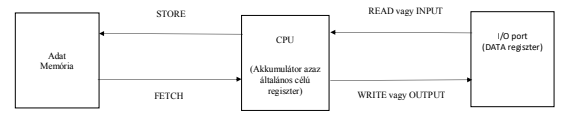
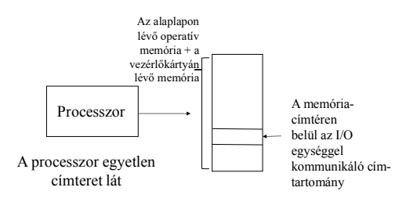
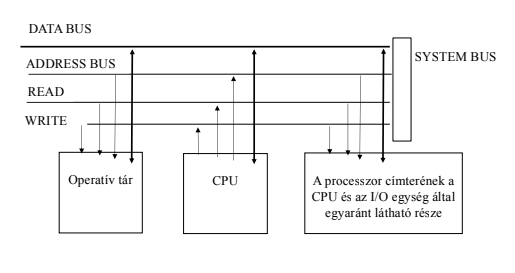
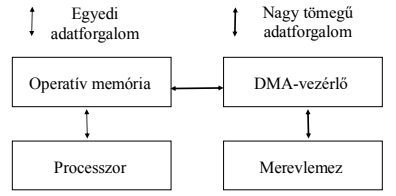

## A működés szerinti osztályozás
1. A CPU részvételével: programozott I/O
2. A CPU kiiktatásával: DMA
3. Speciális I/O processzorral

## A programozott I/O
1. Az I/O címzés
2. Működése, adatátviteli módszerek

## Az I/O címzés
1. A különálló I/O címtér
2. A memória címtérben leképezett I/O

## A különálló I/O címtér
1. Elve
2. Egy I/O port kiválasztása
3. Az I/O port alkotórészei
4. Megvalósítása
5. Egy adatátvitel végrehajtása
6. Értékelés, példa

## Az I/O port alkotórészei
**Fogalma**
Azokat a regisztereket, amelyeken keresztül a periféria és a processzor között
kapcsolat létrehozható, I/O portoknak nevezzük.

**Klasszikus alkotóelemei**
1. parancs (command) regiszter
2. adatbemeneti (data input) regiszter
3. adatkimeneti (data output) regiszter
4. állapot (status) regiszter

**Újabb alkotóelemei**
1. jelenlét-ellenőrzési regiszter
2. működőképesség-ellenőrzési regiszter
3. periféria típus-azonosító regiszter
4. egyes funkciókhoz több regiszter

## Egy adatátvitel végrehajtása
**Egy I/O-egység és memória közötti átvitel két CPU-utasítás végrehajtását igényli**

**Egy regiszternyi adat inputjának esemény-sorozata a következő:**
- az I/O cím alapján kiválasztásra kerül a megfelelő I/O port;
- a processzor beírja az adott egység parancsregiszterébe a kiszolgálási igényét, majd mással kezd foglalkozni;
- az adott periféria egy regiszternyi adatot küld az adat-bemeneti regiszterbe;
- mihelyt itt rendelkezésre áll az adat, a periféria egy megszakítás-kérést küld a processzor felé;
- a processzor megszakítás-kezelő rutinja beolvassa a megszakítás-kérést küldő periféria állapot-regiszterének tartalmát, mely a READY bit beállításával jelzi, hogy a kért adat rendelkezésére áll az adatbemeneti regiszterben;
- a processzor beolvassa az adatbemeneti regiszter tartalmát az akkumulátorába;
- ezután a soron következő programutasítástól függ, hogy az adott akkumulátor-tartalommal mi történik, például STORE utasítás esetén a memóriában kerül eltárolásra, ADD utasítás esetén hozzáadásra kerül az utasításban szereplő memóriacím tartalmához.

## A memória címtérben leképezett I/O elve (memory mapped I/O)

### Értékelés, példa
**Értékelés**
Ennek a módszernek az előnye, hogy végtelenül egyszerű. Hátránya, hogy minden adatforgalom a processzoron keresztül zajlik, annak az akkumulátor névvel jelölt általános célú regiszterén keresztül s így azt erősen terheli.

**Példa**
I/O porton keresztül kommunikál az IBM PC-vel kompatibilis gépeknél a billentyűzet, az egér, a modem, stb.

## A memória címtérben leképezett I/O megvalósítása

### Értékelés, példa
**Értékelés**
Ez a módszer gyorsabb átvitelt biztosít, mint a különálló címterű I/O, viszont az adatátvitelt még mindig csak a processzor részvételével lehet megvalósítani.

**Példa**
A legtipikusabb memória-címtérben leképezett egység a PC képernyője. A legtöbb grafikus rendszer megengedi a mikroprocesszor számára, hogy közvetlenül megcímezze azt a frame buffert, amely a képernyőn az adott pillanatban megjelenő képet tartalmazza.

## A programozott I/O működése, adatátviteli módszerek
### Feltétel nélküli, közvetlen adatátvitel
**A következő esetekben alkalmazzuk**
- mindenféle feltételtől függetlenül kell az adatátvitelt végrehajtani;
- átvitelnél a periféria mindig adatátvitelre kész állapotban van;
- ellenőrzésre sem előtte, sem utána nincs szükség.
  semmiféle szinkronizáció nincs a processzor és a periféria között.

**Tipikus alkalmazások**
- világító kijelző (LED) működtetése;
- érzékelők lekérdezése, leolvasása;
- kapcsolóállás beolvasása.

**Hátránya**
Különösen kivitelnél semmi visszacsatolás nincs az adat fogadásáról, így
adatvesztés következhet be.

## Feltételes adatátvitel
**Lekérdezéses átvitel**

**Menete**
Az I/O egység állapotának a CPU által történő megállapítása a következő lépéseket
igényli:
1) Az állapot-információ beolvasása;
2) Az állapot tesztelése annak meghatározásához, hogy az egység készen áll-e az adatátvitel megkezdésére;
3) Ha nincs kész, visszatérés az 1) lépéshez; egyébként az adatátvitel lefolytatása.

**Értékelés**
Ha egy 10 MIPS-es gépet veszünk alapul, akkor csak egy nyomtatás egyetlen
másodperce alatt 10 millió utasítást végezhet el a CPU. Tehát ha így nézzük,
hihetetlen pazarlás a fenti ciklust futtatni.

**Megszakításos átvitel**
A processzornak az átviteli feladatokra fordított idejét célszerű minimalizálni. Ezért olyan
módszert kell alkalmazni, amely ezt lehetővé teszi. Ez a módszer a megszakításos
adatátvitel, amelyben a periféria kezdeményezi az átvitelt. Az ilyen átvitel lebonyolításához az I/O portoknak regiszterekkel kell rendelkeznie.
- az átvitel kezdetén a megfelelő utasítás kiadásával a processzor jelzi az I/O eszköz számára az átvitelre vonatkozó indítási igényét, majd valami mást kezd csinálni;
- a periféria önállóan gondoskodik az adat eléréséről. Mihelyt elérte, beírja az I/O port bemeneti adatregiszterébe, s egy megszakítási kérelmet küld a processzor felé;
- a processzor megszakítja a közben végzett munkáját, kiolvassa a kiszolgálást kérő periféria állapot-regiszterét. Az annak tartalmának megfelelő megszakítási rutint meghívva kiolvassa a bemeneti adatregiszter tartalmát s beírja azt a processzoron belül lévő akkumulátorba.

**Értékelés**
A megszakításos adatátvitel előnye a lekérdezéses átvitellel szemben, hogy a processzor
lényegesen kevesebb időt tölt el az adatátvitel irányításával. Ugyanakkor továbbra is a
processzoron keresztül zajlik az átvitel és a nagyobb sebességű eszközök (pl. a merevlemez) esetében már nem kellő sebességű ez az eljárás.

## A CPU kiiktatásával: DMA (Direct Memory Access)
**Mikor alkalmazzuk a DMA átvitelt?**
A közvetlen tárhoz fordulást (DMA)
- a nagyobb sebességű eszközök használata;
- nagyobb tömegű adat átvitele és
- adatblokkos adatátvitel esetén célszerű alkalmazni.

## A DMA felprogramozása
A DMA vezérlők használatakor annak több paraméterét
választhatóan lehet beállítani. Ilyen lehetőségek:
- írási vagy olvasási műveletre van szükség;
- a szükséges I/O egység címe;
- a memória-cím kezdő-értéke, ahonnan olvasunk vagy ahova írunk;
- az átviendő egységek jellege (bájt, félszó, szó...)
- az olvasandó vagy írandó egységek száma
- a sínhasználat módja (blokk-sínciklusos, cikluslopásos);
- a DMA vezérlő csatornáihoz prioritási értéket rendelhetünk hozzá.
- az átviteli kapcsolat választása. A tároló-I/O eszköz kapcsolat mellett, létrehozható memória-memória vagy I/O-I/O eszköz kapcsolat is.
## Blokkos átvitel (burst cycle mode)
Ha az átvitel blokkos formájú (például winchester esetén), akkor célszerű a sínt az átvitel teljes időtartamára lekötni. Ekkor a DMA segítségével bonyolított adatátvitel a következő lépésekkel írható le:
**Processzor oldal**
- a processzor megvizsgálja az I/O eszköz állapotjelzőjét, hogy fogadni tudja-e az átviteli kérelmet. Ha nem tudja fogadni, akkor egy hibavizsgáló rutin elindításával a processzor megpróbálja megállapítani a hiba okát;
- a processzor kiadja az átviteli utasítást és a szükséges paramétereket (az átviendő blokk kezdőcímét, hosszát, az átvitel irányát) az előírt módon előkészíti a DMA vezérlő számára;
- elindítja a DMA vezérlőt.
**DMA oldal**
- a sín előkészítése az adatátvitelre;
	= DMA sínkérelem (DMA REQUEST) jelzése;
	= a sínciklus befejezése;
	= a processzor engedélyezi a sín használatát (DMA ACKNOWLEDGE);
- a cím sínre tétele;
- az adat sínre tétele;
- a számláló csökkentése; ha nem nulla, akkor további adatok címzése, átvitele;
- ha a számláló = 0, akkor a sínkérelem megszüntetése;
- megszakítási kérelem a processzor felé, annak jelzésére, hogy az átvitel véget ért.
**Processzor oldal**
- a processzor ellenőrzi a DMA vezérlőt az átvitel végrehajtásának sikerességéről;
- a sínhasználat engedélyezést megszünteti.

## Cikluslopásos DMA átvitel (cycle stealing)
Ha az átviendő adatok nem blokkos formájúak (például gyorsnyomtató esetén), akkor csak egy-egy adat átvitelére kell igénybe venni a sínt. Ezt az eljárást nevezik cikluslopásnak, amely tulajdonképpen a sín időosztásos használata a processzorral közösen.

## A cikluslopásos DMA átvitel folyamata
1. A DMA fölprogramozása után, amikor az IO egység kész az adatátvitelre, az aktiválja a CPU DMA REQUEST vezérlővonalát. A CPU vár a következő DMA töréspontig. Ezután lemond a memória adat- és címsín vezérléséről és aktiválja a DMA ACKNOWLEDGE jelzést. Vegyük észre, hogy a DMA REQUEST és a DMA ACKNOWLEDGE lényegében a BUS REQUEST és a BUS ACKNOWLEDGE vonal a memóriasín számára. A szimultán DMA megszakítások kezelése a sín prioritásos vezérlési technikáknál megtárgyaltakhoz hasonlóképpen oldhatók meg. 
2. Most az IO egység és a memória között megvalósul a közvetlen adatátvitel. Miután egy adat-egységet átvittünk, az IOAR és a DC sorrendben inkrementálódik és dekrementálódik.
3. Amennyiben a DC-t nem dekrementáltuk nullára, de az I/O egység nincs ready állapotban a következő adat küldésére vagy fogadására, visszaadja a vezérlést a CPU-nak
- a memóriasín felszabadításával és
- a DMA REQUEST vonal deaktivizálásával.
A CPU a DMA ACKNOWDLEGE vonal deaktiválásával és normál művelet visszajelzéssel válaszol.
4. Ha a DC nullára dekrementálódik, akkor az IO egység ismét lemond a memóriasín vezérléséről. Ez küldhet egy interrupt jelzést a CPU számára. A CPU válaszolhat az IO egység leállításával vagy egy új IO átvitel kezdeményezésével.
## Speciális I/O processzorral

- A DMA vezérlő csupán parciálisan vezérli az I/O műveletet. Az I/O processzor (IOP) bevezetésével lehet megvalósítani az I/O műveleteknek a CPU-tól független teljes vezérlését. A DMA vezérlőhöz hasonlóan az IOP is képes az operatív memória közvetlen elérésére és a CPU munkájának megszakítására, de ezen kívül képes közvetlen programfeldolgozásra is.
- Ezen programok, melyeket I/O programoknak hívunk, a CPU utasításkészletétől eltérő utasításkészlettel rendelkezik, azaz egy olyannal, mely kifejezetten a az I/O műveletekre irányul. Napjaink architektúrájára általánosan jellemző, hogy a számítógépes rendszer CPU-ja mellett kisebb számítógépeket alkalmaznak IOP-ként. 
- Az IOP több, független adatátvitelt képes megvalósítani az operatív tár és a egy vagy több I/O egység között, úgy, hogy közben nem fordul a CPU-hoz. Az IOP általában az eszközökhöz csatlakozik és saját sínt vezérel (I/O sín, PCI sín, AGP sín).