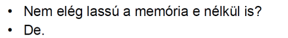
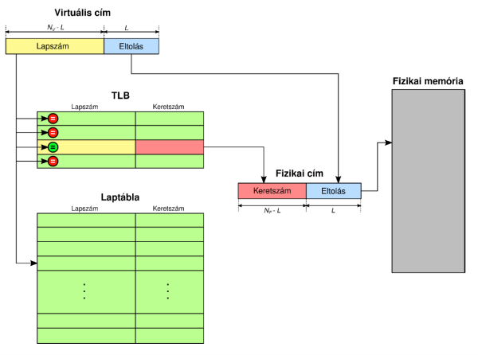
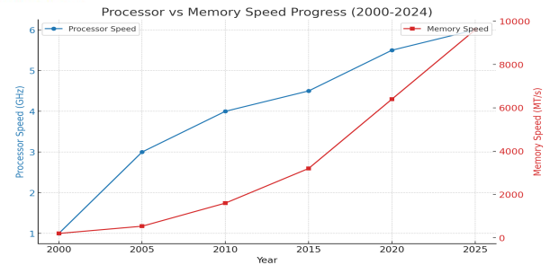
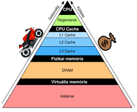
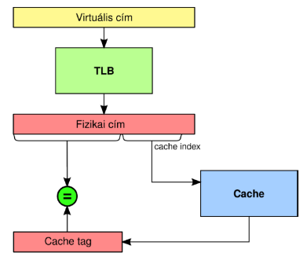
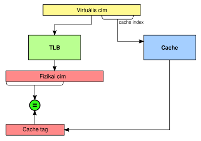
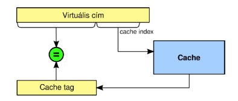

- Memória hozzáférés menete:
	- Címfordítás: Fizikai cím előállítása a virtuálisból
	- Tényleges adat olvasás/írás a fizikai címről/címre
- A laptábla is a fizikai memóriában van
- 1 memóriaművelet a programba
	-> >= 2 memóriaművelet a valóságban
	
- Reménység: lokalitás

**TLB: Translation Lookaside Buffer**
- A gyakran használt virtuális <-> fizikai összerendelések cache-e
- Címfordításkor először a TLB-ben keres
**TLB lefedettség**: a TLB bejegyzések által lefedett címtartomány
- Minél nagyobb, annál ritkábban kell a lassú laptáblához nyúlni
**TLB megvalósítása**: tartalom szerint címezhető memória
- Nagy a felülete és sokat fogyaszt
- Szűkös a tárolási kapacitás

| TLB méret                        | 16 - 512 bejegyzés |
| -------------------------------- | ------------------ |
| Találat ideje                    | 0.5 - 1 órajel     |
| TLB hiba esetén címfordítási idő | 10 - 100 órajel    |
| TLB hibaarány                    | 0.01% - 1%         |

## Hardware menedzselt TLB
**Címfordítás**: CPU/MMU..
	- először a TLB-ből próbálkozik
	- TLB hiba esetén: **bejárja a laptáblát..**
		- Valid = 1 : TLB update
		- Valid = 0 : Laphiba -> operációs rendszert hív, majd újrapróbálkozik

Laphiba kezelése: Az operációs rendszer...
	- megkapja a keresett lap számát
	- saját nyilvántartása alapján betölti a lemezről (ha ott van, ha üres létrehoz egyet)
	- elhelyezi a fizikai memóriába (esetleg kidob onnan valakit)
	- frissíti a laptáblát
Példa: x86, x86-64, ARM, POWER

## Software menedszelt TLB
Címfordítás: CPU/MMU..
	- először a TLB-ből próbálkozik
	- TLB hiba esetén: **operációs rendszert** hív, majd újrapróbálkozik
TLB hiba kezelés: Az operációs rendszer..
	- megkapja a keresett lap számát
	- bejárja a saját laptábláját:
		- Valid = 1 : beírja a CPU TLB-be a lap <-> keret összerendelést
		- Valid = 0 : mint eddig (swap-elés, laptábla frissítés)
	- **Mindenképp frissíti a TLB-t**

**Előnye**
- Nincs hardware megkötés, op. rendszer frissítéssel jöhet hatékonyabb laptábla
- Bonyolultabb adatszerkezetek is használhatók

**Hátránya**
- Sokkal lassabb címfordítás (TLB hiba esetén)
- Lassú

Példa: SPARC, Alpha, MIPS, félig a PA-RISC

A virtuális tárkezelés tetézi a bajt:
- 1 memóriabeli objektum elérése -> több memóriaművelet
- 
A programok nem véletlenszerűen nyulkálnak a memóriában, sokszor speciális mintázatot követnek (kihasználható!).

Lokalitás elvek:
- **Időbeli**: egyszer hozzányúltunk, többször is hozzá fogunk
- **Térbeli**: ha hozzányúltunk, a környezetéhez is hozzá fogunk
- **Algoritmikus**: speciális adatszerkezet kiszámítható bejárása

Példa:
- Médialejátszás:
		- Térbeli lokalitás: igen, időbeli lokalitás: nem
- Ciklusszervezés:
		- A ciklusmag kódjára teljesül a térbeli és időbeli lokalitás is

Ha van lokalitás: vigyük a gyakran használt adatokat gyakrabb memóriába, közel a CPU-hoz
Az SRAM gyorsabb, mint a DRAM.
Kisebb memória -> nagyobb sebesség (jel terjedési idő)

## Cache megvalósítások
Címzési mód szerint:
- Transzparens:
	- A címtartomány egy részének másolata a gyors memóriában van
- Nem transzparens:
	- A címtartomány egy része alatt a gyors memória van

Menedzsment szerint:
- Implicit menedzsment:
	- A gyors memória tartalmát a hardware kezeli
- Explicit menedzsment:
	- A gyors memória tartalmát a futó alkalmazás kezeli

|                           | Címzési mód      | Menedzsment |
| ------------------------- | ---------------- | ----------- |
| Transzparens cache        | Transzparens     | Implicit    |
| Software-menedzselt cache | Transzparens     | Explicit    |
| Önszervező scratch-pad    | Nem transzparens | Implicit    |
| Scratch-pad memória       | Nem transzparens | Explicit    |

**Transzparens cache: klasszikus CPU cache**
Scratch-pad memória: DSP-k, mikrokontrollerek, Playstation 3
Software-menedzselt cache:
- Nincs cache találat -> software feladata a cache update
Tárolási egységek: blokk (= cache line)
- Blokkok mérete: 2^L
- Címek alsó L bitje: blokkon belüli elosztás
- Felső bitek: blokk sorszáma
A cache minden blokkja mellé tárolt járulékos információ:
- Cache tag
- Valid bit: ha = 1, ez a cache blokk érvényes
- Dirty bit: ha = 1, erre a cache blokkra történt írás mióta itt van
A cache szervezés alap kérdése:
- Hogy tároljuk a blokkokat a cache-ben:
	- Hogy gyorsan kereshető legyen
	- Hogy egyszerű (gyors és olcsó) legyen

## Cache + virtuális memória
Mit tároljon a cache:
	- Fizikai memória blokkjait, mert:
		- Kisebb -> kevesebb blokk van benne -> a cache tag és a komparátorok keskenyebbek lehetnek
		- Mert a tárhierarchiában a fizikai memória van alatta

### Fizikailag indexelt cache fizikai tag-gel
Minden memóriaművelet:
1. Címfordítás
2. Cache indexelés (halmaz kiválasztás)
3. Komparálás (halmazon belül hol lehet)

### Virtuálisan indexelt cache fizikai tag-gel
Cache indexelés (halmaz kiválasztás) a virtuális címmel!
Minden memóriaművelet:
1. Egyidejűleg:
	- Címfordítás
	- Cache indexelés (halmaz kiválasztása)
2. Komparálás (halmazon belül hol lehet)

### Virtuálisan indexelt cache virtuális tag-gel
Az egész cache virtuális címekre épül.
Minden memóriaművelet:
1. Cache indexelés (halmaz kiválasztása)
2. Komparálás (halmazon belül hol lehet)

Címfordítás csak cache hiba esetén kell!
Hátrány:
- Szélesebb a tag (mert a virtuális cím szélesebb, kivéve PAE)
- Ha a keretet több lappal lehet elérni, többször lesz bent a cache-ben

