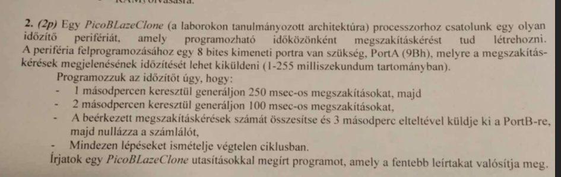

#### 1. feladat
Egy rendszer, mely 16 bites virtuális címzést alkalmaz lapozással, 10 bites lapcímeket használ. Ebbe a rendszerbe illesszünk egy DMA vezérlő perifériát, melynek felprogramozásához egy 16 bites [PortAL: 32Ah (alsó byte), PortAH: 32Bh (felső byte)] és egy 8 bites [PortB: 3A5h] kimeneti portra van szükség. A DMA-val átvitt tömbök mérete legyen mindig egy lapnyi méretű. 

Programozzuk fel a DMA vezérlőt úgy, hogy 10 tömbátvitel történjen meg, a következő paraméterekkel (tekintsük úgy, hogy csak ezek a műveletek szükségesek egy átvitel elindításához):
- az első memóriatömb kezdőcíme 0080h, melyet a PortA 16 bites regiszterbe írunk be,
- ezt minden újabb átvitel-indítás előtt megnöveljük egy lap lokációinak számával egyenlő értékkel,
- a tömb méretét a PortB-re kell kiírni.

Az átvitelek végrehajtásának végét, a DMA vezérlő megszakításban jelzi. A megszakításkezelő függvény olvassa be a PortC [0x3FEh], bemeneti porton érkező állapotbájtot, mely az elvégzett DMA burst átvitelek számát jelzi.
Ha ez a szám eléri a tízet, akkor a program lépjen ki.

Írjunk egy C programrészletet, amely a fentebb leírtakat valósítja meg. Tekintsük úgy, hogy a C programban használhatóak a következő függvények:

```c
data_8bits = inportb (address); // 8 bit olvasása a megadott című port-ról
outportb (address, data_8bits); // 8 bit írásra a megadott című port-ra
interrupt handler_function (); // megszakításkezelő függvény
```

```c
unsigned char burst_transfer_nr, burst_transfer_nr_previous = 0;
unsigned char burst_transfer_done = 0;
int memaddress = 0x0080; // 128 byte

void main (){
	while (burst_transfer_done==0){
		if (burst_transfer_nr_previous < burst_transfer_nr){
			burst_transfer_nr_previous = burst_transfer_nr;
			outportb(0x32A, (memaddress&0xFF)); // Kezdeti memoriatomb-cim also byte kuldese (PortAL)
			outportb(0x32B, memaddress>>8); // Kezdeti memoriatomb-cim felso byte kuldese (PortAH)
			outportb(0x3A5, 64); // tomb meretenek kuldese a PortB-re
			memaddress= memaddress+64;
		}
	}
}

interrupt handler_function (){
	burst_transfer_nr = inportb(0x3FE); // A mar elvegzett burst atvitelek szamanak beolvasasa a PortC-rol
	if (burst_transfer_nr==10) burst_transfer_done=1;
}
```
**Megjegyzés**: A megszakításfüggvényeket nem hívjuk meg, mivel azok elindítását és végrehajtását (a főfüggvény ciklusának valamely két utasítása között) a processzor megszakításrendszere végzi.

#### 2. feladat


```psm
namereg S3, counter       ; Counter for time intervals
namereg S4, intCount      ; Stores the number of interrupts received

loop:
    load S1, FA           ; Load 250ms timer value
    output S1, 9B         ; Send 250ms interval to PortA

    ; --- Handle 1 second of 250ms interrupts (4 cycles) ---
    loop_250ms:
        compare counter, 04
        call c, next_timer  ; If counter > 4, go to next phase
        call z, next_timer  ; If counter == 4, go to next phase
        add counter, 01
        jump loop_250ms

    ; --- Handle 2 seconds of 100ms interrupts (20 cycles) ---
    load S1, 64           ; Load 100ms timer value
    output S1, 9B         ; Send 100ms interval to PortA
    loop_100ms:
        compare counter, 14
        jump z, output_int_count  ; If counter == 20, output sum
        jump c, output_int_count  ; If counter > 20, output sum
        add counter, 01
        jump loop_100ms

    ; --- Output the total interrupt count after 3s ---
    output_int_count:
        output intCount, 9C  ; Send interrupt count to PortB
        load intCount, 00    ; Reset interrupt count
        jump loop            ; Repeat the whole process

next_timer:
    load counter, 00        ; Reset counter
    return

; --- Interrupt Service Routine (ISR) ---
inter_routine:
    add intCount, 01        ; Increment interrupt count
    returni E               ; Return from interrupt

address 3FF
    jump inter_routine

```
#### 3. feladat

| Architektúra | 1 szó = ? byte  |
| ------------ | --------------- |
| 8-bit        | 1 byte (8 bit)  |
| 16-bit       | 2 byte (16 bit) |
| 32-bit       | 4 byte (32 bit) |
| 64-bit       | 8 byte (64 bit) |
